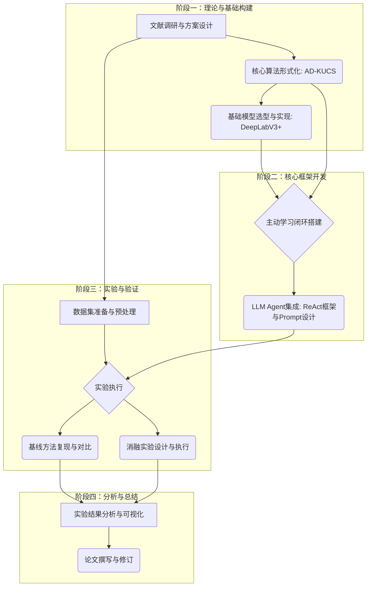

# 研究方案/开题报告

---

## **LLM智能体驱动的自适应主动学习在滑坡遥感影像语义分割中的应用研究**

**An LLM Agent-driven Adaptive Active Learning Approach for Landslide Semantic Segmentation from Remote Sensing Imagery**

---

**研究领域**：人工智能 / 遥感图像处理 / 地质灾害监测

**关键词**：大型语言模型 (LLM)、智能体 (Agent)、主动学习 (Active Learning)、滑坡识别 (Landslide Detection)、语义分割 (Semantic Segmentation)

---

## **摘要**

滑坡灾害的早期识别与监测对于防灾减灾具有重要意义。深度学习技术，尤其是语义分割模型，在从遥感影像中自动提取滑坡边界方面展现出巨大潜力，但其性能高度依赖于大规模、高质量的像素级标注数据集。然而，获取此类标注数据成本高昂、耗时耗力，已成为制约该领域发展的核心瓶颈。

主动学习（Active Learning）通过智能地选择最有价值的样本进行标注，有望显著降低标注成本。但现有主动学习策略多依赖单一的数学度量，难以有效平衡"不确定性探索"与"新知识发现"，且缺乏可解释性。

本研究旨在提出一种由大型语言模型（LLM）智能体驱动的自适应主动学习范式（AAL-SD），并以滑坡遥感影像语义分割为核心应用场景进行验证。核心创新包括：（1）设计一种自适应动态混合查询算法（AD-KUCS），能够根据学习进度自动调整"不确定性"与"知识增益"的权重；（2）将LLM Agent引入主动学习决策环，使其作为"策略师"和"解释者"，实现从"计算驱动"到"认知驱动"的范式转变，并赋予决策过程可解释性。

本研究将在国际公认的Landslide4Sense数据集上进行严谨的对比实验和消融研究，并以跨区域/跨数据集（例如 CAS Landslide Dataset 作为备选对照）作为可选补充验证，证明所提方法的有效性与可迁移性。预期成果包括一套开源的AAL-SD框架代码、AD-KUCS算法的详细定义，以及一篇高质量的学术论文。

---

## **目录**

1.  [研究背景与意义](#1-研究背景与意义)
    *   1.1 研究背景
    *   1.2 问题定义与研究意义
2.  [研究目标、内容与技术路线](#2-研究目标内容与技术路线)
    *   2.1 研究目标
    *   2.2 研究内容
    *   2.3 技术路线
3.  [数据集获取、处理与规划](#3-数据集获取处理与规划)
    *   3.1 数据集来源与选择
    *   3.2 数据预处理流程
    *   3.3 数据集使用规划
4.  [算法研究与实验设计](#4-算法研究与实验设计)
    *   4.1 核心算法研究：AD-KUCS
    *   4.2 实验设计与评估体系
5.  [预期成果、创新点与时间安排](#5-预期成果创新点与时间安排)
    *   5.1 预期研究成果
    *   5.2 本研究的创新点
    *   5.3 研究计划与时间安排
6.  [参考文献](#6-参考文献)

---

## **1. 研究背景与意义**

### **1.1 研究背景**

近年来，随着全球气候变化加剧与人类工程活动的增强，滑坡、泥石流等地质灾害的发生频率和破坏性显著上升，对人民生命财产安全和社会经济发展构成严重威胁。利用遥感技术进行大范围、高效率的滑坡灾害早期识别与监测，已成为防灾减灾领域的关键研究方向。

深度学习，特别是以U-Net、DeepLabV3+等为代表的语义分割模型，在从高分辨率遥感影像中自动提取滑坡边界方面取得了巨大成功，其精度已在许多场景下超越传统机器学习方法。然而，这些数据驱动模型的性能高度依赖于大规模、高质量、像素级的标注数据集。在滑坡灾害领域，获取这样的数据集面临着严峻的挑战：

1.  **标注成本高昂**：滑坡灾害样本的标注需要具备专业地质知识的专家进行，过程耗时耗力，成本极高。
2.  **样本分布不均**：滑坡灾害在空间和时间上具有偶发性和稀疏性，导致数据集中正负样本（滑坡与非滑坡区域）比例严重失衡。
3.  **形态多样性**：不同区域的滑坡在规模、形态、纹理、植被覆盖等方面差异巨大，对模型的泛化能力提出了极高要求。

**主动学习（Active Learning, AL）**被认为是解决“数据饥渴”问题的有效途径。其核心思想是通过设计高效的查询策略（Query Strategy），让模型主动选择“最有价值”的未标注样本交由专家进行标注，以期用尽可能少的标注成本，获得尽可能高的模型性能。然而，现有应用于遥感图像分割的主动学习方法大多存在局限性，例如，过度依赖单一的“不确定性”准则，容易陷入局部最优，对多样性和新颖性的探索不足。

与此同时，大型语言模型（LLM）的崛起，特别是其在充当智能代理（Agent）方面展现出的强大推理、规划和工具使用能力，为构建更智能、更接近人类思维的主动学习策略提供了全新的可能性。将LLM Agent的决策能力引入主动学习循环，有望克服传统查询策略的局限性，实现从“基于数学计算”到“基于认知推理”的范式转变。

### **1.2 问题定义与研究意义**

本研究旨在解决深度学习滑坡识别模型在**数据标注成本高昂**和**样本选择效率低下**的核心痛点。具体而言，当前研究存在以下关键问题：

> **核心问题**：如何设计一种高效、智能且可解释的主动学习策略，能够在有限的标注预算下，最大化滑坡识别模型的性能，并有效平衡学习过程中的“不确定性探索”与“新知识发现”？

针对上述问题，本课题拟提出一种**由大型语言模型智能体驱动的自适应混合主动学习范式（An LLM Agent-driven Adaptive Hybrid Active Learning Paradigm）**，并以滑坡灾害的遥感影像语义分割为核心应用场景进行验证。本研究的理论与实践意义在于：

1.  **理论意义**：
    *   **探索新的主动学习范式**：将LLM Agent的推理能力与主动学习的查询策略相结合，提出一种全新的、具备可解释性的智能决策框架，突破传统依赖单一数学度量的查询策略的局限性。
    *   **深化人机协作机制**：构建一个由Agent引导的、更符合人类专家认知习惯的“人-机-模型”协同标注与学习闭环，提升人机交互效率。

2.  **实践意义**：
    *   **显著降低标注成本**：通过更智能的样本选择，有望将构建高性能滑坡识别模型所需的标注数据量降低一个数量级，为该领域的广泛应用扫清障碍。
    *   **提升模型性能与泛化能力**：通过平衡不确定性与多样性探索，避免模型陷入局部最优，从而训练出更鲁棒、泛化能力更强的滑坡识别模型。
    *   **提供可推广的解决方案**：本研究提出的方法论具有良好的通用性，未来可推广至其他数据稀疏的遥感应用场景（如建筑物变化检测、冰川监测），并支持通过更换数据集/任务实现跨场景验证。
## **2. 研究目标、内容与技术路线**

### **2.1 研究目标**

本研究的总体目标是：**构建一个由LLM智能体驱动的自适应主动学习框架（AAL-SD），并验证其在滑坡遥感影像语义分割任务中，相比传统主动学习方法在提升标注效率和模型性能方面的优越性。**

为实现此总体目标，设定以下三个具体研究目标：

1.  **设计并实现一种自适应混合查询算法（AD-KUCS）**。该算法能够动态地平衡“不确定性”和“知识增益”两种采样策略，以适应主动学习在不同阶段的侧重点。算法的动态调整机制将由LLM Agent根据学习状态进行引导和解释。

2.  **构建一个完整的、由LLM Agent驱动的主动学习闭环系统**。该系统以深度学习语义分割模型为核心，以AD-KUCS算法为查询策略，以LLM Agent为决策和解释引擎，能够完成从模型训练、样本查询、模拟标注到模型更新的完整迭代流程。

3.  **设计并执行一套严谨的对比实验方案**。通过在公开的滑坡遥感影像数据集上进行充分实验，从性能-成本曲线、关键评估指标（如mIoU）、消融研究等多个维度，定量地评估并证明所提出的AAL-SD框架及AD-KUCS算法相较于多种基线方法（随机采样、不确定性采样、多样性采样、SOTA方法等）的有效性和先进性。

### **2.2 研究内容**

围绕上述研究目标，本研究将重点开展以下四个方面的内容：

1.  **主动学习查询策略的算法研究**：深入分析现有主动学习查询策略的优缺点，聚焦于“不确定性”与“多样性”的结合方式。重点研究如何设计一个能够根据学习进度自适应调整权重的混合采样函数，并将其形式化为AD-KUCS算法。探索如何将LLM的推理能力融入权重调整和样本排序过程。

2.  **LLM Agent在主动学习中的角色与架构设计**：研究如何将LLM Agent无缝集成到主动学习循环中。定义Agent的角色（策略师、解释者）、目标（选择最优样本）和可用工具（调用算法函数、获取模型状态）。设计一套高效的Prompt Engineering方案，特别是包含Chain-of-Thought（CoT）的系统提示，以引导Agent进行结构化、可解释的决策。

3.  **面向滑坡识别的深度学习模型构建**：选择并实现一个先进的语义分割模型（如DeepLabV3+）作为主动学习框架的基础模型。研究该模型在滑坡数据集上的训练策略、损失函数选择（如Focal Loss、Dice Loss以应对样本不均衡）以及性能评估指标（mIoU, F1-Score）。

4.  **实验验证与分析**：在至少一个大规模公开滑坡数据集（如Landslide4Sense）上，搭建完整的实验流程。系统地比较本研究提出的方法与多种基线方法的性能差异。通过消融实验，验证AD-KUCS算法中动态权重、知识增益模块以及LLM Agent的必要性。对实验结果进行深入分析，总结方法优势，并探讨其在不同场景下的适用性。

### **2.3 技术路线**

为实现上述研究内容，本研究将遵循以下技术路线，该路线以AAL-SD框架的构建和验证为核心，分为四个主要阶段：

**技术路线详解：**

1.  **阶段一：理论与基础构建**
    -   **文献调研**：系统梳理主动学习、遥感图像分割、LLM Agent领域的相关工作。
    -   **算法形式化**：将AD-KUCS算法的数学模型（包括动态λ函数、U/K度量）进行严格定义。
    -   **基础模型实现**：基于PyTorch，实现并调试一个DeepLabV3+语义分割模型，确保其在滑坡数据集上能进行基本的训练和推理。

2.  **阶段二：核心框架开发**
    -   **闭环搭建**：构建一个Python脚本，实现主动学习的基本循环逻辑：从未标注池中选择样本 -> 加入已标注集 -> 重新训练模型。
    -   **Agent集成**：设计`AgenticADKUCSSampler`类，将AD-KUCS算法的计算结果作为上下文，通过精心设计的Prompt模板，调用LLM API（如GPT-4o），让Agent在ReAct框架下进行推理和决策，并解析其输出作为最终的样本选择结果。

3.  **阶段三：实验与验证**
    -   **数据准备**：获取并预处理Landslide4Sense等公开数据集，将其划分为初始标注集、未标注池和固定的测试集。
    -   **实验执行**：运行完整的AAL-SD框架，记录每一轮迭代后的模型性能，生成性能-成本曲线。
    -   **基线对比**：在完全相同的实验设置下，复现并运行多种基线方法（随机采样、熵采样、Core-Set等），作为对比参照。
    -   **消融研究**：通过“阉割”AD-KUCS算法或AAL-SD框架的特定组件（如固定λ、移除K项、用简单argmax替代Agent决策），来验证每个创新点的有效性。

4.  **阶段四：分析与总结**
    -   **结果分析**：将所有实验结果进行可视化（如绘制性能曲线图、生成混淆矩阵），并进行统计显著性分析。
    -   **论文撰写**：根据实验结果，系统地撰写学术论文，清晰地阐述研究动机、方法创新、实验设置、结果分析和结论。
## **3. 数据集获取、处理与规划**

高质量、标准化的数据集是本研究成功的基础。本节将详细阐述研究所需数据集的获取来源、处理流程以及在研究不同阶段的使用规划。

### **3.1 数据集来源与选择**

为保证研究的公平性、可复现性以及与当前最先进技术（SOTA）的可比性，本研究将主要采用国际公认的、大规模的公开滑坡遥感影像数据集。同时，为验证方法的可迁移性，将引入一个滑坡领域的备选公开数据集作为补充对照实验（可选）。

**表 3.1：核心及辅助数据集**

| 数据集名称 | 类型 | 核心优势与研究用途 |
| :--- | :--- | :--- |
| **Landslide4Sense** | **核心训练/测试集** | 国际计算机视觉顶会（ICCV）竞赛数据集，包含全球多地的多光谱遥感影像，是当前滑坡识别领域的**黄金标准**，用于核心算法的训练、验证和SOTA对比。 |
| **CAS Landslide Dataset** | **辅助训练/测试集** | 由中国科学院发布，规模较大，场景多样。可作为备选或与Landslide4Sense结合使用，以增强数据多样性。 |
| **中意大利基准数据集** | **辅助评估集** | 专为滑坡敏感性评估设计，提供坡度单元级别的详尽地质、地形数据，可用于验证模型在不同地理环境下的性能。 |
| （可选）跨数据集对照 | **可迁移性补充验证** | 以同任务/同领域的备选数据集（如 CAS Landslide Dataset）进行对照验证，检验策略与工程框架在不同数据分布下的稳健性。 |

**数据获取途径**：以上数据集均为公开发布，可通过其官方网站或GitHub仓库下载。所有数据的使用将严格遵守其发布许可协议。

### **3.2 数据预处理流程**

原始的遥感影像数据需要经过一系列标准化处理，才能输入深度学习模型进行训练。预处理流程旨在消除无关变量干扰，并使数据格式符合模型要求。

**标准化预处理流程：**

1.  **数据清洗与筛选**：检查数据集的完整性，剔除标注质量过低或影像云量过高的样本。

2.  **影像配准与裁剪**：
    *   对多源、多时相的影像进行精确的地理配准，确保空间位置的一致性。
    *   由于原始遥感影像尺寸过大，无法直接输入模型，需将其裁剪为固定大小的图像块（Patch），例如`256x256`或`512x512`像素。对应的像素级标注掩码（Mask）也需进行同步裁剪。

3.  **数据增强（Data Augmentation）**：
    *   为扩充训练样本数量，缓解样本不均衡，并提升模型的鲁棒性，将对训练集中的图像块进行在线（On-the-fly）数据增强。
    *   **几何增强**：随机进行旋转（90/180/270度）、水平/垂直翻转、随机缩放。
    *   **色彩增强**：轻微调整亮度、对比度、饱和度。

4.  **数据划分**：
    *   将预处理后的数据集严格划分为三个互不相交的集合：
        *   **初始标注集 (L_0)**：一小部分（默认约 5% 训练集；以代码配置为准）随机抽取的、带标注的样本，用于启动主动学习的第一轮训练。
        *   **未标注池 (U)**：其余训练样本（例如，若测试集占总数据约20%，则未标注池约占总数据 75% 左右）不带标注（仅保留影像）的样本，作为主动学习的“题库”。
        *   **固定测试集 (T)**：固定的一部分（例如，总数据的20%）带标注的样本，**在整个主动学习过程中永不用于训练**，仅用于最终评估所有方法的模型性能，以保证评估的公平一致。

### **3.3 数据集使用规划**

为确保研究的系统性和聚焦性，不同阶段将使用不同的数据集组合。

**表 3.2：数据集使用阶段规划**

| 研究阶段 | 主要任务 | 使用的数据集 | 目的 |
| :--- | :--- | :--- | :--- |
| **阶段一：原型验证** | 快速实现并跑通MVP（最小可行产品） | **Landslide4Sense** (少量样本) | 验证代码逻辑和主动学习循环的正确性。 |
| **阶段二：核心实验** | 完整的算法训练与对比 | **Landslide4Sense** (全集) | 进行所有基线方法与本研究方法的全面对比实验，生成核心性能-成本曲线。 |
| **阶段三：消融研究** | 验证各创新点的必要性 | **Landslide4Sense** (全集) | 通过移除或替换AD-KUCS算法的特定模块，证明其设计的合理性。 |
| **阶段四：跨数据集对照（可选）** | 检验策略稳健性与可迁移性 | **CAS Landslide Dataset** | 在同任务/同领域但不同分布的数据集上复用框架与策略，验证泛化与复现能力。 |

通过以上规划，本研究将确保数据使用的科学性、规范性和前瞻性，为获得可靠、有说服力的研究成果提供坚实的数据支撑。
## **4. 算法研究与实验设计**

本章是整个研究方案的核心，将详细阐述作为方法论创新的核心算法（AD-KUCS）的设计思想，以及用于验证该算法有效性的严谨实验设计。

### **4.1 核心算法研究：AD-KUCS**

AD-KUCS（Adaptive Dynamic Knowledge-Uncertainty Sampling）是一种自适应混合查询策略，其设计目标是克服传统主动学习方法在“探索”（Exploration，发现新知识）和“利用”（Exploitation，巩固已知）之间的静态平衡问题。

#### **4.1.1 算法总体框架**

对于任意一个未标注池 `U` 中的样本 `x`，其被选择的价值得分 `Score(x)` 由以下公式决定：

**Score(x) = (1 - λ_t) * U(x) + λ_t * K(x)**

-   `U(x)`：**不确定性度量**，代表模型对样本 `x` 的“困惑程度”，侧重于“利用”策略，旨在巩固和精化模型的决策边界。
-   `K(x)`：**知识增益度量**，代表样本 `x` 所蕴含的“新颖性”或“代表性”，侧重于“探索”策略，旨在拓展模型的认知范围，避免陷入局部最优。
-   `λ_t`：**自适应权重**，一个随学习轮次 `t` 动态变化的参数，用于在“利用”和“探索”之间进行智能权衡。

#### **4.1.2 不确定性度量 U(x)**

本研究将采用语义分割任务中广泛使用的、基于模型输出熵（Entropy）的度量方式。对于样本 `x`（一个图像块），模型会为每个像素 `i` 输出一个概率分布 `p_i`。整个样本的不确定性 `U(x)` 将是所有像素熵的平均值：

**U(x) = - (1/N) * Σ [ p_i * log(p_i) ]** (对所有像素i求和)

高熵值意味着模型对该样本的像素级分类非常不确定，标注该样本能有效帮助模型澄清决策边界。

#### **4.1.3 知识增益度量 K(x)**

为有效度量样本的“新颖性/覆盖不足”，本研究采用与实现一致的 `coreset-to-labeled` 定义（默认主路径），而非将聚类作为主方法的必要步骤：

1.  **特征提取**：为每个样本抽取特征向量 `f_x`（与实现一致的特征来源）。
2.  **覆盖度计算（对齐实现）**：对任意未标注样本 `x`，定义
    - `d_min(x)=min_{l∈L} ||f_x - f_l||`
    - `K(x)=d_min(x)/max_pairwise_dist(L)`
    其中 `L` 为已标注集特征集合，归一化用于避免尺度漂移。
3.  **含义**：`K(x)` 越大表示该样本在特征空间中离现有已标注覆盖更远，更可能带来新信息。

注：聚类（如 K-Means）在本仓库中主要用于部分基线策略（例如 DIAL-style）的实现，不作为主方法默认 K 项定义。

#### **4.1.4 自适应权重 λ_t**

`λ_t` 的动态调整是AD-KUCS算法的核心。本研究采用一个受学习进度驱动的Sigmoid函数控制其变化（实现中 `progress=current_round/total_rounds`）：

**λ_t = 1 / (1 + exp(-α * (t / T_max - 0.5)))**

-   `t` 为当前轮次，`T_max` 为总轮次，`t/T_max` 代表学习进度。
-   在学习**初期**（`t` 较小），`λ_t` 接近0，算法**优先选择不确定性高**的样本。
-   在学习**后期**（`t` 较大），`λ_t` 接近1，算法**优先选择知识增益大**（代表性强）的样本。

#### **4.1.5 LLM Agent的决策与解释作用**

LLM Agent在本算法中扮演“高级决策者”和“解释者”的角色，其作用超越了简单的数值计算：

-   **智能决策**：Agent接收所有候选样本的 `U(x)`、`K(x)` 和 `Score(x)` 作为输入，结合当前的 `λ_t` 值和学习阶段，通过Chain-of-Thought（CoT）推理，做出最终的样本选择。这允许在简单的数值排序之外，引入更复杂的启发式规则（例如，“虽然样本A的总分略低于B，但其K值极高且我们已连续5轮选择高U值的样本，故本轮应选择A以增强探索”）。
-   **过程可解释性**：Agent必须为其每一个选择生成一段自然语言解释，说明其决策是基于当前阶段的何种策略（优先U还是优先K），以及为何在众多候选者中做出此选择。这为理解和调试算法提供了前所未有的透明度。

### **4.2 实验设计与评估体系**

为科学、客观地评估本研究提出的AAL-SD框架及AD-KUCS算法的性能，将设计一套包含多维度评估指标、多梯度对比基线和严谨消融研究的综合实验方案。

#### **4.2.1 评估指标**

| 指标类别 | 具体指标 | 评估目的 |
| :--- | :--- | :--- |
| **核心性能指标** | **性能-成本曲线** | 以标注样本数量为横轴，模型在固定测试集上的性能（mIoU）为纵轴，绘制曲线。**曲线下面积（ALC）越大，说明方法效率越高**。这是评估主动学习方法好坏的**黄金标准**。 |
| **模型分割精度** | **平均交并比 (mIoU)** | 语义分割任务最核心的像素级精度指标。 |
| | **F1-Score** | 综合考虑模型的精确率（Precision）和召回率（Recall），对于样本不均衡问题具有很好的参考价值。 |
| **效率指标** | **标注效率增益** | 达到某一相同性能水平（如mIoU=75%）时，本方法所需标注样本数相比基线方法节省的百分比。 |

#### **4.2.2 基线方法 (Baselines)**

为充分证明方法的先进性，将选择涵盖不同策略、不同复杂度的多种基线进行对比。

| 基线类别 | 具体方法 | 策略描述 |
| :--- | :--- | :--- |
| **无策略** | **Random Sampling** | 随机选择样本进行标注。作为所有策略的**最低性能参照**。 |
| **经典不确定性** | **Entropy Sampling** | 选择模型输出平均像素熵最高的样本。 |
| **经典多样性** | **Core-Set** | 选择能最大程度覆盖整个未标注池特征空间的样本子集。 |
| **混合策略SOTA** | **BALD** | (Bayesian Active Learning by Disagreement) 一种经典的、同时考虑不确定性和模型分歧的贝叶斯方法。 |
| **LLM对照组** | **LLM-US / LLM-RS** | 让LLM Agent仅基于单一的不确定性分数（US）或随机分数（RS）进行决策。用于**剥离和验证Agent的复杂推理能力是否带来了超越其基础语言能力的额外增益**。 |

#### **4.2.3 消融研究 (Ablation Study)**

为验证本研究提出的AD-KUCS算法及AAL-SD框架中每个创新组件的必要性，将设计以下消融实验。

| 实验设置 | 描述 | 验证目标 |
| :--- | :--- | :--- |
| **AD-KUCS (完整模型)** | 本研究提出的完整方法。 | 作为性能上限。 |
| **w/o Agent** | 移除LLM Agent，直接使用`argmax(Score(x))`进行选择。 | 验证Agent的智能决策是否优于简单的数值排序。 |
| **w/o K (Uncertainty only)** | 固定 `λ_t = 0`，即只使用不确定性采样。 | 验证知识增益模块的必要性。 |
| **w/o U (Knowledge only)** | 固定 `λ_t = 1`，即只使用知识增益采样。 | 验证不确定性模块的必要性。 |
| **Fixed λ (λ=0.5)** | 使用固定的、非动态的权重。 | 验证`λ_t`动态自适应调整的有效性。 |

#### **4.2.4 实验流程**

所有实验将遵循统一的、标准化的主动学习流程：

1.  **初始化**：从数据集中划分出初始标注集 `L_0`、未标注池 `U` 和固定测试集 `T`。
2.  **启动**：使用 `L_0` 训练一个初始的DeepLabV3+模型。
3.  **迭代循环**：重复以下步骤，直到达到预设的标注预算 `T_max`。
    a.  **查询**：在 `U` 上，使用当前待评估的查询策略（如AD-KUCS、BALD等）选择 `B` 个（例如B=100）最有价值的样本。
    b.  **模拟标注**：将被选中的 `B` 个样本从 `U` 移动到 `L`，并揭示其真实标注。
    c.  **再训练**：在更新后的 `L` 上，从头开始（from scratch）或微调（fine-tune）DeepLabV3+模型。
    d.  **评估**：使用再训练后的模型，在**固定测试集 `T`** 上计算mIoU、F1-Score等指标，并记录结果。
4.  **结果生成**：根据每一轮记录的性能和当前的标注样本数，绘制性能-成本曲线，并计算最终的ALC值。
## **5. 预期成果、创新点与时间安排**

### **5.1 预期研究成果**

本研究预期将产出一系列具有理论价值和实践意义的成果，主要包括：

1.  **一套完整的、由LLM Agent驱动的自适应主动学习框架（AAL-SD）**：
    *   **形式**：一个模块化的、可扩展的Python代码库。
    *   **内容**：包含数据处理、模型训练、智能体决策、主动学习循环等核心模块，可作为一个开源项目发布，供后续研究者使用和扩展。

2.  **一种新颖的、自适应混合查询算法（AD-KUCS）**：
    *   **形式**：算法的详细数学定义、伪代码和可独立调用的Python实现。
    *   **内容**：该算法将作为本研究的核心方法论贡献，其有效性将通过严谨的实验得到证明。

3.  **一份高质量的学术论文**：
    *   **形式**：一篇符合国际顶级期刊或会议（如IEEE TGRS, ISPRS Journal, CVPR, ICCV）标准的学术论文。
    *   **内容**：系统阐述本研究的动机、方法、实验和结论，论文将包含丰富的图表（性能-成本曲线、消融实验结果、可视化分析等）来支撑观点。

4.  **一份详细的实验报告与数据集**：
    *   **形式**：一份包含所有实验设置、原始数据、结果图表和分析的综合技术报告。
    *   **内容**：为保证研究的可复现性，将整理并发布用于本研究的标准化数据集划分、预处理代码以及所有实验的配置文件。

### **5.2 本研究的创新点**

本研究的创新性主要体现在以下三个方面：

1.  **范式创新：首次将LLM Agent引入遥感主动学习决策环**
    *   突破了传统主动学习完全依赖预定义数学公式的局限，引入了LLM的推理、规划和上下文理解能力，实现了从“计算驱动”到“认知驱动”的范式转变。
    *   通过Agent的Chain-of-Thought（CoT）能力，使得样本选择过程具有前所未有的**可解释性**，为理解和信任AI决策提供了新的途径。

2.  **算法创新：提出动态自适应的混合查询策略AD-KUCS**
    *   设计的动态权重`λ_t`能够根据学习阶段自动调整“探索”与“利用”的平衡，比现有固定权重或手动调整的混合策略更智能、更高效。
    *   在知识增益的度量上，采用与实现一致的 `coreset-to-labeled` 覆盖度定义（基于特征距离的“离已标注覆盖的最近距离”），以量化样本的新颖性/覆盖不足。

3.  **实验设计创新：引入LLM对照组与跨数据集对照（可选）**
    *   通过设计专门的LLM对照组实验，能够科学地剥离并验证Agent的复杂推理能力所带来的真实增益，而不仅仅是其基础语言能力的表现，增强了结论的说服力。
    *   通过同任务/同领域的跨数据集对照（例如 Landslide4Sense 与 CAS Landslide Dataset 间的复用验证），检验策略与工程框架在不同数据分布下的稳健性与可迁移性。

### **5.3 研究计划与时间安排**

为确保研究的顺利进行，本课题拟定为期9个月的研究周期，并将其划分为三个主要阶段。每个阶段都有明确的任务、交付成果和里程碑。

**表 5.1：研究工作时间安排（Gantt图）**

| 阶段 | 主要任务 | 月份1-3 | 月份4-6 | 月份7-9 | 交付成果/里程碑 |
| :--- | :--- | :--- | :--- | :--- | :--- |
| **阶段一** | **基础构建与原型验证** | | | | |
| | 1.1 文献调研与方案细化 | ████ | | | 详细的文献综述报告 |
| | 1.2 数据集准备与预处理 | ██████ | | | 标准化的数据集文件 |
| | 1.3 基础模型与AL循环搭建 | ████████ | | | 可运行的MVP代码 |
| | **里程碑M1** | | | | **完成MVP，跑通完整循环** |
| **阶段二** | **核心攻关与实验执行** | | | | |
| | 2.1 AD-KUCS与Agent集成 | | ██████ | | 完整的AAL-SD框架代码 |
| | 2.2 基线方法复现 | | ████████ | | 所有基线方法代码 |
| | 2.3 核心对比实验与消融实验 | | ██████████ | | 全部的原始实验数据 |
| | **里程碑M2** | | | | **完成所有核心实验** |
| **阶段三** | **分析、总结与论文撰写** | | | | |
| | 3.1 跨数据集对照（可选） | | | ████ | 跨数据集实验数据 |
| | 3.2 实验结果分析与可视化 | | | ██████ | 论文所需全部图表 |
| | 3.3 论文初稿撰写 | | | ████████ | 论文初稿 |
| | 3.4 论文修改与投稿 | | | ████████ | **完成最终论文并投稿** |
| | **最终里程碑** | | | | **课题完成** |

**各阶段详细说明：**

-   **阶段一（前3个月）**：工作的重点是“把路铺好”。完成所有基础准备工作，确保技术路线可行，并产出一个可以工作的最小化产品。这是后续所有研究的基础。
-   **阶段二（中3个月）**：这是研究的“攻坚期”。集中精力实现核心的AD-KUCS算法和Agent集成，并以极高的效率完成所有对比实验和消融实验，产出支撑论文核心观点的全部数据。
-   **阶段三（后3个月）**：工作的重心转向“讲好故事”。进行补充性的泛化实验以提升论文高度，并投入主要精力进行数据分析、图表绘制和高质量学术论文的撰写与反复修改，直至最终投稿。

---

## **6. 参考文献**

[1] Ghorbanzadeh, O., et al. (2022). "Landslide4Sense: Reference Benchmark Data and Deep Learning Models for Landslide Detection." *IEEE Transactions on Geoscience and Remote Sensing*.

[2] Gal, Y., & Ghahramani, Z. (2016). "Dropout as a Bayesian Approximation: Representing Model Uncertainty in Deep Learning." *Proceedings of the 33rd International Conference on Machine Learning (ICML)*.

[3] Sener, O., & Savarese, S. (2018). "Active Learning for Convolutional Neural Networks: A Core-Set Approach." *International Conference on Learning Representations (ICLR)*.

[4] Wei, J., et al. (2022). "Chain-of-Thought Prompting Elicits Reasoning in Large Language Models." *Advances in Neural Information Processing Systems (NeurIPS)*.

[5] Yao, S., et al. (2023). "ReAct: Synergizing Reasoning and Acting in Language Models." *International Conference on Learning Representations (ICLR)*.

[6] Guo, J., et al. (2024). "LightRAG: Simple and Fast Retrieval-Augmented Generation." *arXiv preprint arXiv:2410.05779*.

[7] Chen, L. C., et al. (2018). "Encoder-Decoder with Atrous Separable Convolution for Semantic Image Segmentation (DeepLabV3+)." *Proceedings of the European Conference on Computer Vision (ECCV)*.

[8] Settles, B. (2009). "Active Learning Literature Survey." *Computer Sciences Technical Report 1648, University of Wisconsin–Madison*.

[9] Ren, P., et al. (2021). "A Survey of Deep Active Learning." *ACM Computing Surveys*.

[10] Huang, F., et al. (2024). "ChatGLM2-Based Landslide Knowledge Graph Construction and Monitoring." *Remote Sensing*.

[11] Ding, Y., et al. (2025). "LHAKG: A Large-Scale Landslide Hazard Analysis Knowledge Graph Construction Framework." *International Journal of Digital Earth*.

---

**文档信息**

-   **版本**：V1.0
-   **日期**：2025年1月
-   **生成工具**：Manus AI
