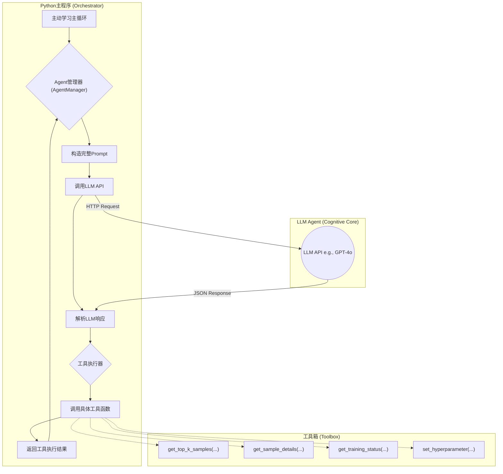

# LLM-Agent 决策系统构建方案

## 第一部分：整体架构与核心组件设计

### 1.1 整体架构

我们的LLM-Agent决策系统是一个**外部驱动的、基于工具使用的ReAct智能体**。其核心思想是将**高层认知决策**（由LLM完成）与**底层数值计算**（由Python函数完成）彻底分离，并通过一个严格的协议进行交互。

**架构图如下：**



### 1.2 核心组件详解

#### 1.2.1 Python主程序 (Orchestrator) - 已实现

这是整个主动学习流程的"指挥官"，负责驱动整个流程。在每个主动学习迭代的"决策"阶段，它会**暂停**自身的执行，并将控制权**移交**给Agent管理器。

-   **职责**：
    1.  执行模型训练、预测、评分等数值计算任务。
    2.  通过 `AgentManager` 类管理 Agent 决策流程（已实现）
    3.  维护 `training_state` 状态机，提供梯度诊断信号（已实现）
    4.  记录完整的 trace 日志确保可审计性（已实现）
    2.  在需要决策时，调用`AgentManager.run()`方法，并传入当前的状态信息。
    3.  接收Agent管理器返回的最终决策（如“选择样本X”），并执行该决策。

#### 1.2.2 Agent管理器 (AgentManager) - 已实现

这是连接Python世界和LLM世界的"翻译官"和"外交官"，是整个系统的**中枢**。它是一个Python类，负责管理与LLM的完整交互周期。

-   **职责**：
    1.  **状态管理**：维护一个包含所有历史交互记录的对话历史（`history`）。
    2.  **Prompt构造**：将系统Prompt、对话历史和当前任务组合成一个完整的、发送给LLM的Prompt。
    3.  **API调用**：负责向LLM API（如OpenAI API）发送请求并获取响应。
    4.  **响应解析**：使用正则表达式或JSON解析，从LLM的文本响应中提取出`Thought`和`Action`。
    5.  **工具调度**：根据解析出的`Action`，调用相应的Python工具函数。
    6.  **循环控制**：管理ReAct的循环，直到LLM输出最终答案（`Final Answer`）或达到最大迭代次数。
    7.  **工具使用统计**：记录每个工具的使用次数，防止过度调用（已实现）
    8.  **Trace日志记录**：将所有交互记录到 trace.jsonl 中确保可审计性（已实现）

#### 1.2.3 LLM Agent (Cognitive Core)

这是智能体的“大脑”，是一个通过API调用的、无状态的语言模型（如GPT-4o, Claude 3.5）。它本身不存储任何信息，所有的“思考”都基于Agent管理器在每次调用时提供的上下文。

-   **职责**：
    1.  **理解情境**：基于输入的Prompt，理解当前主动学习的阶段和面临的问题。
    2.  **制定策略**：进行Chain-of-Thought（CoT）推理，形成解决问题的策略。
    3.  **使用工具**：决定调用哪个工具来获取决策所需的信息。
    4.  **综合决策**：在获取足够信息后，做出最终决策，并以指定的格式输出。

#### 1.2.4 工具箱 (Toolbox)

这是一组定义好的、供LLM Agent调用的Python函数。每个函数都应该设计成**原子化、功能单一、输入输出明确**的。

-   **设计原则**：
    1.  **信息获取类工具**：只返回信息，不改变系统状态。例如`get_top_k_samples()`。
    2.  **状态改变类工具**：会改变系统状态，需要谨慎设计。例如`set_hyperparameter()`。
    3.  **无副作用**：工具函数不应有任何隐藏的副作用。
    4.  **详细的Docstring**：每个工具函数都必须有详细的文档字符串（Docstring），解释其功能、参数和返回值。这部分Docstring将直接注入到System Prompt中，作为Agent的"工具使用说明书"。

-   **已实现的核心工具**：
    - `get_system_status()`: 获取系统状态和梯度诊断指标（已实现）
    - `get_score_distribution()`: 获取样本评分分布（已实现，限制调用次数）
    - `get_top_k_samples()`: 获取top-k样本信息（已实现）
    - `get_sample_details()`: 获取样本详细信息（已实现）
    - `set_hyperparameter()`: 设置超参数（当前配置下权限受限）
## 第二部分：决策流程与ReAct循环设计

### 2.1 决策流程概览

Agent的决策并非一步到位，而是一个**迭代式**的“思考-行动-观察”循环，即**ReAct (Reasoning and Acting)** 框架。这个循环会持续进行，直到Agent认为已经收集到足够的信息来做出最终决策。

**决策流程图：**

```mermaid
flowchart TD
    A(Start: 主程序传入任务和状态) --> B{1. 思考 (Thought)}
    B --> C{2. 行动 (Action)}
    C --> D[3. 执行 (Execution)]
    D --> E{4. 观察 (Observation)}
    E --> F{是否已收集足够信息?}
    F -- 否 --> B
    F -- 是 --> G(5. 最终答案 Final Answer)
    G --> H(End: 返回决策给主程序)
```

### 2.2 ReAct循环详解

让我们以一个具体的例子来详细拆解这个循环：

**初始任务 (由Python主程序发起)**：

> **User Query**: 当前是第50轮迭代（共100轮），请从Top-5候选样本中选择一个最优样本进行标注。

--- 

**循环 1**

1.  **思考 (Thought)** - *LLM生成*
    > 我需要从Top-5候选样本中选择一个。现在是第50轮，处于学习中期，根据AD-KUCS算法，我应该平衡不确定性(U)和知识增益(K)。我需要先看看这5个候选样本的具体得分情况。

2.  **行动 (Action)** - *LLM生成*
    ```json
    {
      "tool_name": "get_top_k_samples",
      "parameters": {
        "k": 5
      }
    }
    ```

3.  **执行 (Execution)** - *Python执行*
    `AgentManager`解析`Action`，调用`get_top_k_samples(k=5)`函数。该函数返回一个包含5个样本信息的JSON字符串。

4.  **观察 (Observation)** - *Python生成*
    ```json
    {
      "status": "success",
      "result": [
        {"id": "sample_123", "U_score": 0.9, "K_score": 0.2, "final_score": 0.55},
        {"id": "sample_456", "U_score": 0.8, "K_score": 0.4, "final_score": 0.60},
        {"id": "sample_789", "U_score": 0.3, "K_score": 0.9, "final_score": 0.60},
        ...
      ]
    }
    ```
    `AgentManager`将这个`Observation`追加到对话历史中，然后带着整个历史再次调用LLM。

--- 

**循环 2**

1.  **思考 (Thought)** - *LLM生成*
    > 我看到了Top-5样本的得分。`sample_456`和`sample_789`的最终得分并列最高。`sample_456`的不确定性很高，说明模型对它很“纠结”，标注它有助于优化决策边界。`sample_789`的知识增益很高，说明它是一个很“新颖”的样本，标注它有助于拓宽模型的视野。考虑到现在是学习中期，平衡两者很重要。我想看看`sample_456`的具体图像特征，比如它是不是位于两种地貌的交界处，这通常是不确定性高的原因。

2.  **行动 (Action)** - *LLM生成*
    ```json
    {
      "tool_name": "get_sample_details",
      "parameters": {
        "sample_id": "sample_456"
      }
    }
    ```

3.  **执行 (Execution)** - *Python执行*
    `AgentManager`调用`get_sample_details(sample_id="sample_456")`，返回该样本的详细元数据，如地理位置、坡度、是否有植被覆盖等。

4.  **观察 (Observation)** - *Python生成*
    ```json
    {
      "status": "success",
      "result": {"id": "sample_456", "location": [34.5, 108.9], "slope": 45, "vegetation_coverage": 0.8, "is_boundary": true}
    }
    ```

--- 

**循环 3**

1.  **思考 (Thought)** - *LLM生成*
    > `sample_456`确实位于边界区域，这解释了其高不确定性。标注这种样本对于模型学习区分不同地貌的边界非常有价值。虽然`sample_789`也很新颖，但在学习中期，解决模型的“纠结”比单纯“开眼界”更重要。因此，我决定选择`sample_456`。

2.  **行动 (Action)** - *LLM生成*
    ```json
    {
      "tool_name": "Final Answer",
      "parameters": {
        "selected_sample_id": "sample_456",
        "reasoning": "该样本不确定性高，且位于地貌边界，标注它对优化模型决策边界有重要价值，符合当前学习阶段的目标。"
      }
    }
    ```

--- 

**循环结束**

`AgentManager`解析到`Final Answer`，循环结束。它将最终的决策（`selected_sample_id`和`reasoning`）返回给Python主程序。主程序随即安排`sample_456`进入标注流程。

### 2.3 关键设计要点

-   **状态传递**：每一次调用LLM，都必须传入完整的、包含所有历史`Thought`, `Action`, `Observation`的对话历史，因为LLM本身是无状态的。
-   **工具的原子性**：工具函数的设计必须足够简单，一次只做一件事，这样Agent才能灵活地组合它们来完成复杂任务。
-   **容错处理**：`AgentManager`必须能处理各种异常，如LLM返回格式错误、工具执行失败等，并将错误信息作为`Observation`返回给LLM，让其自行修正。
-   **终止条件**：必须设置最大循环次数，防止Agent陷入无限循环。
## 第三部分：完整的Prompt工程方案

Prompt是LLM Agent的“灵魂”，它定义了Agent的身份、目标、能力和行为准则。一个精心设计的Prompt是Agent成功的关键。我们将采用一个包含**System Prompt**和**User Prompt**的组合方案。

### 3.1 System Prompt (系统级指令)

System Prompt在整个对话的生命周期中保持不变，它为Agent提供了稳定的“世界观”。它由以下六个核心部分构成：

**[1. 角色扮演 (Role)]**
> 你是一个世界顶级的遥感图像分析专家和主动学习策略师。你的名字叫“GeoMind”。

**[2. 核心目标 (Goal)]**
> 你的核心目标是辅助一个主动学习系统，以最少的标注成本，训练一个高精度的滑坡语义分割模型。在每一轮迭代中，你需要从给定的候选样本中，选择一个“最具信息价值”的样本进行标注。

**[3. 情境感知 (Context)]**
> 当前主动学习的状态如下：
> - 总迭代轮数 (T_max): {{T_max}}
> - 当前迭代轮数 (t): {{t}}
> - 当前自适应权重 (λ_t): {{lambda_t}}
> - 当前模型性能 (mIoU): {{current_miou}}
> 
> 你需要根据当前所处的学习阶段（初期、中期、后期）来调整你的决策策略。初期应侧重不确定性，后期应侧重知识增益。

**[4. 工具箱定义 (Tools)]**
> 你可以使用以下工具来获取决策所需的信息。工具的调用格式为JSON。
> 
> ```json
> {
>   "tool_name": "<工具名称>",
>   "parameters": {
>     "<参数1>": "<值1>",
>     "<参数2>": "<值2>"
>   }
> }
> ```
> 
> **可用工具列表:**
> 
> **Tool 1: `get_top_k_samples`**
> - **Description**: 获取当前最终得分最高的k个候选样本的简要信息。
> - **Parameters**: `k` (integer, default=5): 需要获取的样本数量。
> - **Returns**: 一个包含k个样本信息的JSON列表，每个样本包含 `id`, `U_score`, `K_score`, `final_score`。
> 
> **Tool 2: `get_sample_details`**
> - **Description**: 获取指定ID样本的详细元数据。
> - **Parameters**: `sample_id` (string): 样本的唯一ID。
> - **Returns**: 一个包含样本详细信息的JSON对象，如 `location`, `slope`, `vegetation_coverage`, `is_boundary` 等。
> 
> **Tool 3: `get_training_status`**
> - **Description**: 获取当前模型训练的详细状态，如loss曲线、学习率等。
> - **Parameters**: None.
> - **Returns**: 一个包含训练状态信息的JSON对象。
> 
> **Tool 4: `set_hyperparameter`**
> - **Description**: (高级功能) 调整AD-KUCS算法的超参数，如陡峭因子α。请谨慎使用。
> - **Parameters**: `alpha` (float): 新的陡峭因子α值。
> - **Returns**: 一个确认修改成功的JSON对象。

**[5. 行为准则 (Rules)]**
> 1.  你必须遵循ReAct (Reasoning and Acting) 框架进行思考和行动。
> 2.  每一步都必须先输出`Thought:`，进行详细的、逻辑严密的Chain-of-Thought (CoT) 推理，然后再输出`Action:`。
> 3.  你的`Action:`必须是严格的JSON格式。
> 4.  在收集到足够的信息后，你必须使用`Final Answer`工具来输出最终决策。
> 5.  你的`Final Answer`中必须包含`selected_sample_id`和详细的`reasoning`字段。

**[6. 输出格式 (Output Format)]**
> 你的每一步响应都必须严格遵循以下格式：
> 
> ```
> Thought: <这里是你的思考过程>
> Action: <这里是你的JSON格式的行动>
> ```

### 3.2 User Prompt (用户级指令)

User Prompt是每一轮迭代开始时，由Python主程序动态生成的、描述当前具体任务的指令。它简洁明了，只包含任务本身。

**示例：**

> **User**: 当前是第 {{t}} 轮迭代，请从Top-{{k}}候选样本中选择一个最优样本进行标注。

### 3.3 Prompt的组合与使用

在`AgentManager`中，一次完整的LLM API调用会组合System Prompt、历史对话记录和当前的User Prompt。

**一次典型的API调用结构：**

```python
messages = [
    {"role": "system", "content": system_prompt}, # 静态的系统级指令
    
    # --- 动态的对话历史 ---
    {"role": "user", "content": "...上一轮的用户指令..."},
    {"role": "assistant", "content": "...上一轮Agent的思考与行动..."},
    {"role": "tool", "content": "...上一轮工具的观察结果..."},
    # ... 更多历史 ...

    # --- 当前的任务 ---
    {"role": "user", "content": current_user_prompt} # 当前的用户级指令
]

response = client.chat.completions.create(
    model="gpt-4o",
    messages=messages,
    temperature=0.0 # 为了可复现性，设为0
)
```

通过这种精心设计的Prompt工程，我们可以将一个通用的LLM“塑造”成一个专业的、遵循特定工作流程的智能决策体，从而实现AAL-SD框架的核心价值。
## 第四部分：工具定义与交互协议

工具是Agent与外部世界（我们的Python程序）交互的唯一桥梁。清晰的工具定义和严格的交互协议是保证系统稳定运行的基础。

### 4.1 工具设计原则

1.  **原子性 (Atomicity)**：每个工具只做一件、且定义明确的事。避免设计一个能做很多事情的“万能工具”。
2.  **幂等性 (Idempotency)**：对于信息获取类工具，多次使用相同的参数调用，应返回相同的结果。
3.  **清晰的文档 (Clear Docstrings)**：每个工具的Docstring都必须清晰地描述其功能、参数和返回值。这不仅是给开发者看的，更是给LLM Agent看的“说明书”。
4.  **结构化输入输出 (Structured I/O)**：工具的输入（参数）和输出（返回值）都应是结构化的（如JSON），便于程序解析和LLM理解。

### 4.2 核心工具集定义

以下是我们为AAL-SD框架设计的核心工具集。在Python中，这可以实现为一个`Toolbox`类，其中每个工具都是一个方法。

```python
class Toolbox:
    """一个包含所有可供LLM Agent调用的工具的类。"""

    def get_top_k_samples(self, k: int = 5) -> str:
        """
        获取当前最终得分最高的k个候选样本的简要信息。
        :param k: int, 需要获取的样本数量，默认为5。
        :return: str, 一个包含k个样本信息的JSON字符串列表，每个样本包含 'id', 'U_score', 'K_score', 'final_score'。
        """
        # ... 实现代码 ...
        # 从主程序的数据池中查询并格式化数据
        pass

    def get_sample_details(self, sample_id: str) -> str:
        """
        获取指定ID样本的详细元数据。
        :param sample_id: str, 样本的唯一ID。
        :return: str, 一个包含样本详细信息的JSON字符串，如 'location', 'slope', 'vegetation_coverage', 'is_boundary' 等。
        """
        # ... 实现代码 ...
        # 查询数据库或文件系统获取元数据
        pass

    def get_training_status(self) -> str:
        """
        获取当前模型训练的详细状态。
        :return: str, 一个包含训练状态信息的JSON字符串，如 'current_epoch', 'loss', 'learning_rate', 'miou_history'。
        """
        # ... 实现代码 ...
        # 从训练日志或状态管理器中获取信息
        pass

    def set_hyperparameter(self, alpha: float) -> str:
        """
        (高级功能) 调整AD-KUCS算法的超参数，如陡峭因子α。
        :param alpha: float, 新的陡峭因子α值。
        :return: str, 一个确认修改成功的JSON字符串。
        """
        # ... 实现代码 ...
        # 修改主程序的配置参数
        pass
```

### 4.3 交互协议

交互协议定义了`AgentManager`与LLM Agent之间通信的数据格式。我们将采用基于JSON的严格协议。

#### 4.3.1 Action协议 (LLM → Python)

当LLM需要调用工具时，它生成的`Action`部分必须是以下两种JSON格式之一：

**1. 调用工具 (Tool Call)**

```json
{
  "tool_name": "<工具名称>",
  "parameters": {
    "<参数1>": <值1>,
    "<参数2>": <值2>
  }
}
```

**2. 最终答案 (Final Answer)**

```json
{
  "tool_name": "Final Answer",
  "parameters": {
    "selected_sample_id": "<选择的样本ID>",
    "reasoning": "<做出该选择的详细理由>"
  }
}
```

`AgentManager`的解析器会优先尝试解析这两种JSON格式。

#### 4.3.2 Observation协议 (Python → LLM)

当Python端的工具执行完毕后，`AgentManager`需要将执行结果包装成一个`Observation`，并作为`role: tool`的消息发送给LLM。该`Observation`也必须是统一的JSON格式。

**1. 执行成功**

```json
{
  "status": "success",
  "result": <工具函数返回的原始结果（通常是JSON字符串）>
}
```

**2. 执行失败**

```json
{
  "status": "error",
  "error_type": "<错误类型，如'ToolNotFound', 'InvalidParameters', 'ExecutionError'>",
  "message": "<详细的错误信息>"
}
```

**为什么需要错误协议？**

这个错误处理机制至关重要。当Agent生成了一个错误的`Action`（比如工具名写错了，或者参数类型不对），系统不会崩溃。`AgentManager`会捕获这个错误，并将其包装成一个标准的`Observation`返回给Agent。Agent在接收到这个错误信息后，可以在下一个`Thought`中进行自我修正。

> **Thought**: 我上次调用的`get_top_k_sample`工具名写错了，应该是`get_top_k_samples`。我将修正这个错误并重新调用。

这种**自我修正**的能力，是构建一个鲁棒、可靠的智能体的关键。

通过这套清晰的工具定义和严格的交互协议，我们可以确保Agent的行为是可预测、可管理、可调试的，从而为整个AAL-SD框架的稳定运行提供坚实的基础。
