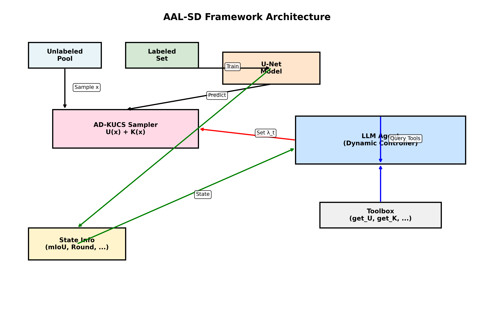
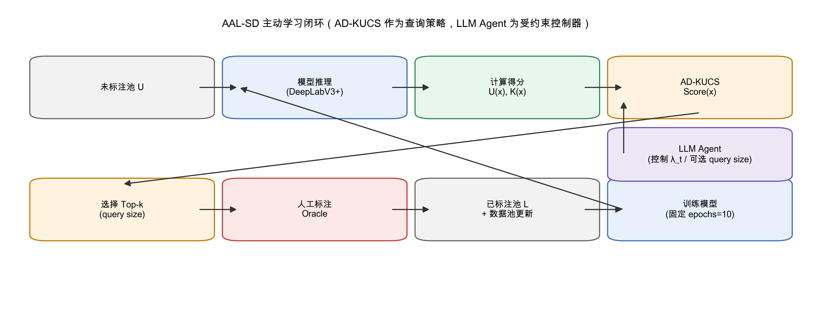
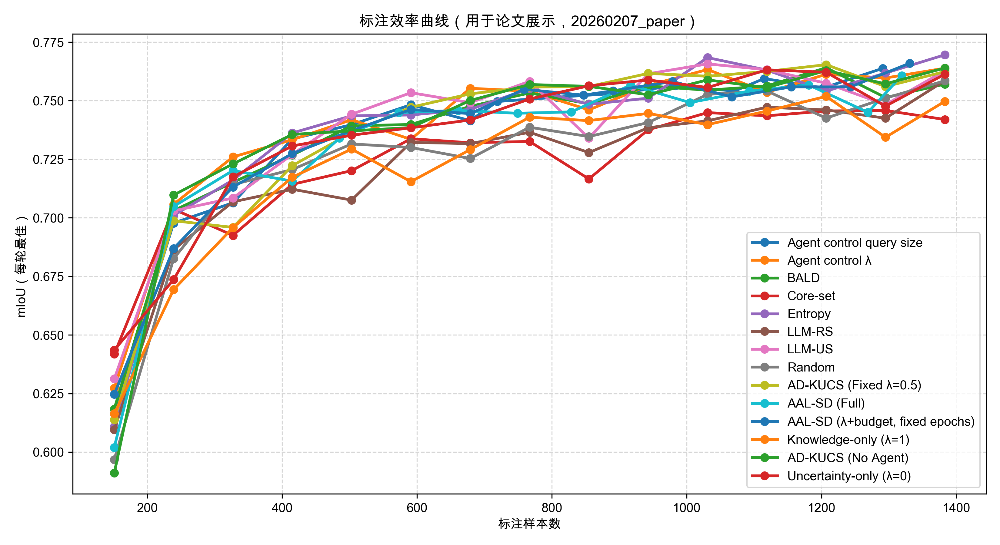
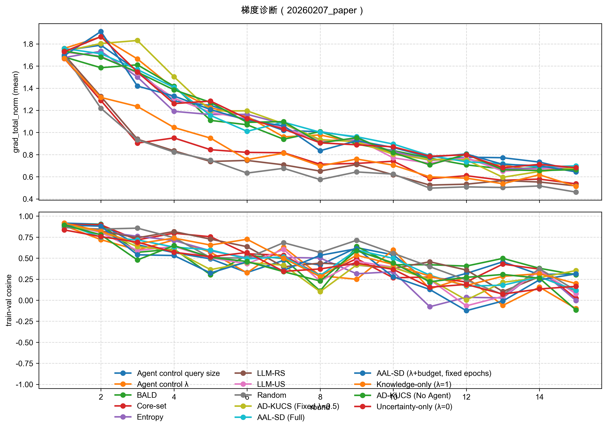
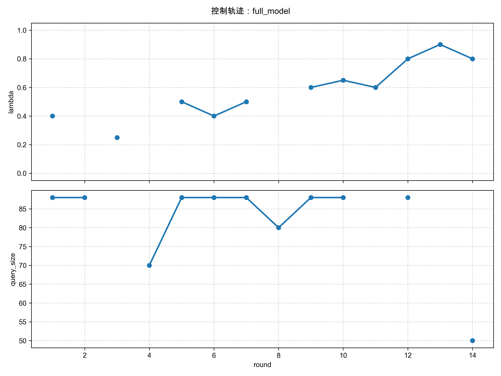
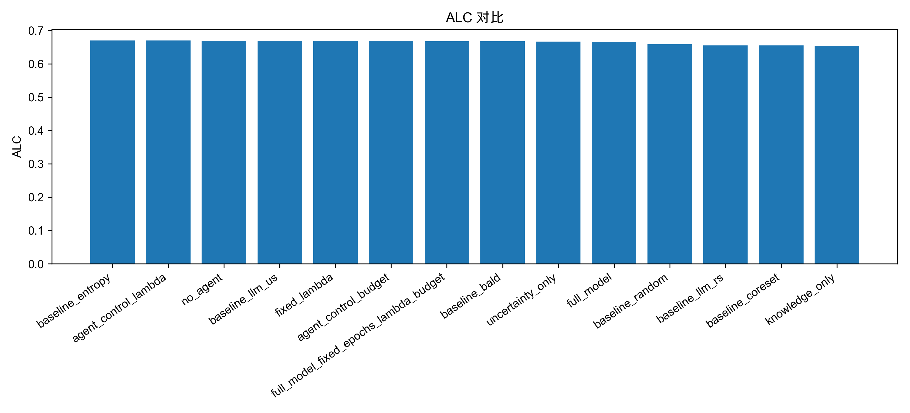
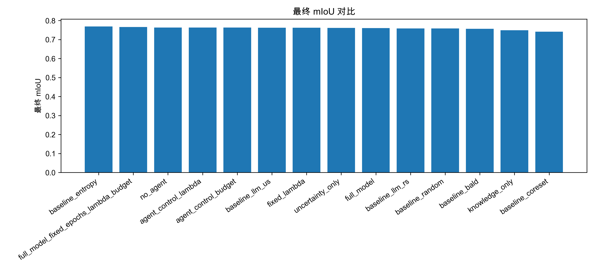

## AAL-SD：面向遥感滑坡检测的 Agent 增强主动学习框架

*说明：本文件为英文稿的内部中文翻译版本，仅用于组内交流与协作修改，不作为期刊投稿稿件。*

作者 A^1，作者 B^2，作者 C^1,*  
^1 单位 1，城市，国家  
^2 单位 2，城市，国家  
* 通讯作者：email@example.com

### 摘要

主动学习（Active Learning, AL）是降低遥感语义分割（包括滑坡制图）高昂标注成本的有效途径。现有多数 AL 方法依赖固定的采样启发式（如不确定性或多样性），但静态策略往往难以匹配不同学习阶段以及随轮次演化的未标注池结构。本文提出 AAL-SD（Agent-Augmented Active Learning for Landslide Detection），将 Agent 组件以“受约束控制接口”的形式集成到主动学习闭环中。核心采样策略为自适应多样性—知识—不确定性采样（AD-KUCS）：对每个未标注样本以“不确定性”和“基于特征空间的 novelty（coreset-to-labeled 距离）”进行凸组合评分。在默认设置中，混合权重由一个确定性的 warmup + 风险驱动闭环策略根据训练信号产生，并将控制动作写入 trace 以便审计；在单独的控制消融中，系统可授予 LLM 在显式约束下直接提出控制量（如 λ 或 query size）的权限。我们在 Landslide4Sense 基准上评测 AAL-SD，并在同一标注预算协议下与多个基线与消融变体对比；同时补充 4 个随机种子（43/44/45/46）的复核实验，以及一个 cross-split 泛化设置（TrainData 作为主动学习池，ValidData 作为逐轮评估集）。在固定训练预算（每轮 10 epochs）下，AAL-SD 的标注效率与强基线处于同一量级；多 seed 结果显示差距较小但并未稳定领先。本文因此强调 AAL-SD 的贡献在于：提供可审计的受约束控制接口与梯度层面的证据，用于解释学习曲线形态差异并提升实验可复现性与可验证性。

### 关键词

主动学习；滑坡检测；语义分割；遥感；大语言模型；Agent

### 1. 引言

遥感影像语义分割是地球观测中的基础任务之一，广泛应用于灾害管理、环境监测与城市规划等场景（Zhu et al., 2017）。滑坡检测尤其具有重要现实意义，但其视觉特征常呈现细微差异与高度异质性，导致深度模型往往需要大量高质量像素级标注以获得稳定性能（Ghorbanzadeh et al., 2022a）。然而，像素级标注高度依赖领域知识，过程费时费力且成本高昂，成为制约滑坡语义分割方法落地的重要瓶颈（Ren et al., 2021）。

主动学习（AL）通过在有限标注预算下优先选择更“有信息量”的样本进行标注，以减少总体标注成本并提升学习效率（Settles, 2009; Ren et al., 2021）。传统 AL 策略（如不确定性采样、基于 core-set 的多样性采样等）通常依赖单一且固定的启发式规则（Settles, 2009; Sener and Savarese, 2018）。这类静态策略虽然在部分阶段有效，但在跨轮次迭代中可能与模型状态和未标注池的“信息结构”发生失配（Ren et al., 2021）。例如，早期更强调不确定性可能更有利；而在后期，为避免在狭小困难区域反复采样而产生收益递减，可能需要更强调覆盖性与新颖性。

近年来，大语言模型（LLM）在推理、规划与决策方面表现出强能力（Zhao et al., 2023）。这启发我们将主动学习的 acquisition 过程表述为“可观测状态→受约束动作”的控制问题，并提供可审计的控制接口。在 AAL-SD 中，默认控制量由确定性的 warmup + 风险驱动闭环策略产生；在专门的控制消融中，系统可授予 LLM 在显式约束下提出控制动作的权限。

本文贡献如下：

1. **面向主动学习的受约束控制接口**：提出 AAL-SD，将采样/查询过程表述为受约束的控制问题，并对控制动作进行记录以支持审计与复现。
2. **AD-KUCS 采样与闭环权重调度**：提出 AD-KUCS，将不确定性—novelty 的权衡权重从静态超参提升为逐轮控制量；默认设置下采用 warmup + 风险驱动的确定性闭环策略生成权重，并在专门消融中评估将控制权限授予 LLM 的情形（在显式约束下）。
3. **全面实验验证与稳健性复核**：在 Landslide4Sense 上与多个基线及消融变体对比，并补充多 seed 评测以复核关键对比的稳健性。

### 2. 相关工作

本文与三条研究脉络相关：（1）**遥感滑坡语义分割**：关注在外观异质、类别不平衡等挑战下的鲁棒分割，并依托 Landslide4Sense 等基准数据集推进可复现对比（Ghorbanzadeh et al., 2022a）。（2）**稠密预测任务的主动学习**：常结合不确定性估计（Settles, 2009）、基于代表性/多样性的 core-set 选择（Sener and Savarese, 2018）与贝叶斯近似（Gal et al., 2017）以在预算约束下选择信息样本。（3）**迭代学习系统的控制器**：研究如何基于状态摘要与受约束动作来调控迭代过程；本文将 acquisition 视为受约束控制接口，并在专门消融中评估 LLM 参与控制的情形（Zhao et al., 2023）。

### 3. 材料与方法

AAL-SD 将 Agent 组件集成到主动学习闭环中，将“查询/选样”（acquisition）暴露为受约束控制接口。需要强调的是，AD-KUCS 是主动学习循环中的查询算法，而非分割识别网络本身；分割模型（如 DeepLabV3+）作为 base learner 负责训练与推理，AD-KUCS 仅使用其输出的概率图与特征嵌入对未标注池进行排序并选择待标注样本。整体架构与闭环位置如图 1a–1b 所示。

#### 3.1. 自适应多样性—知识—不确定性采样（AD-KUCS）

AD-KUCS 为每个未标注样本 $x$ 计算得分，基于其不确定性 $U(x)$ 与知识增益 $K(x)$ 的加权组合。

**不确定性得分 $U(x)$**：我们以整幅影像的像素级熵均值量化不确定性：

$$U(x) = \frac{1}{N} \sum_{i=1}^{N} H(p_i),$$

其中 $N$ 为像素总数，$H(p_i)$ 为像素 $i$ 的预测概率分布的香农熵。

**知识增益得分 $K(x)$**：我们以特征空间中相对已标注集的 novelty 来刻画知识增益，采用 coreset-to-labeled 距离定义。设 $f(x)$ 为样本 $x$ 的特征嵌入（通过在编码器骨干处注册 forward hook 并进行全局平均池化获得）。给定已标注特征集合 $F_L = \{f(l)\mid l\in \mathcal{L}\}$，定义：

- **最近已标注距离**：$d(x,\mathcal{L}) = \min_{l\in \mathcal{L}} \|f(x)-f(l)\|_2$。
- **归一化系数**：$D_L = \max_{l_i,l_j\in \mathcal{L}} \|f(l_i)-f(l_j)\|_2$。

则知识增益为：

$K(x)=\frac{d(x,\mathcal{L})}{D_L}.$ 

该定义鼓励选择在表示空间中远离当前已标注覆盖范围的样本。

**得分归一化**：每一轮中，我们对未标注池上的原始得分采用 min–max 归一化：

$$S_{norm}(x) = \frac{S(x) - \min_{x' \in U} S(x')}{\max_{x' \in U} S(x') - \min_{x' \in U} S(x')}.$$

**融合得分**：最终得分为归一化不确定性与归一化知识增益的线性组合：

$$Score(x) = (1 - \lambda_t) \cdot U_{norm}(x) + \lambda_t \cdot K_{norm}(x),$$

其中 $\lambda_t$ 是轮次 $t$ 的动态权重，为逐轮控制量。在默认设置中，$\lambda_t$ 由 warmup + 风险驱动的确定性闭环策略基于训练状态产生；在单独的控制消融中，系统可授予 LLM 在显式约束下提出 $\lambda_t$ 的权限。

#### 3.2. Agent 作为受约束控制接口

AAL-SD 将采样/查询过程暴露为一个受约束的控制接口。在每轮主动学习开始时，控制器接收一份状态摘要，包含但不限于：

- 当前轮次与总轮次
- 验证集性能（mIoU、F1）
- 相邻轮次性能变化
- 未标注池中 $U(x)$ 与 $K(x)$ 的分布统计
- 上一轮已施加的控制量（例如 $\lambda_t$）

在默认设置中，一个确定性的 warmup + 风险驱动闭环策略将可观测训练信号映射为逐轮控制量 $\lambda_t$，并将实际施加的动作写入 trace 以支持审计与复现。在部分消融设置中，系统可在显式约束与硬边界下授予 LLM 直接提出控制动作（例如 $\lambda_t$ 或每轮 query size）的权限。

为避免“更多训练”带来的混杂因素并突出标注效率，本文采用固定训练协议：所有方法每轮训练 epochs 固定为 10；训练预算自适应调度（如每轮 epochs 动态控制）作为后续增强版本的研究内容。

### 4. 实验与结果

#### 4.1. 实验设置

- **数据集**：使用 Landslide4Sense（Ghorbanzadeh et al., 2022a），包含 3,799 张带像素级标注的影像。
- **模型**：采用 `segmentation_models_pytorch` 实现的 DeepLabV3+，编码器为 ResNet-50，使用 ImageNet 预训练，并适配 14 通道输入。
- **训练协议**：为保证训练预算可比，所有方法每轮训练 epochs 固定为 10。
- **主动学习协议**：将 3,799 张影像划分为测试池 760 张与训练池 3,039 张。AL 初始标注集为 151 张（训练池的 5%），未标注池为 2,888 张。共进行 15 轮训练，其中前 14 轮每轮新增标注 88 张（最后一轮为最终训练轮，不再新增标注），最终标注规模为 1,383。总标注预算设为 1,519 张影像，并用于 ALC 归一化。
- **cross-split 泛化协议**：为更贴近外部域评估（cross-scene validation），我们额外运行 cross-split 设置：TrainData 作为主动学习池（labeled/unlabeled），ValidData 作为每轮评估集（run：`run_src_full_model_with_baselines_seed42__eval_val`）。在该设置下，我们以预算对齐点 |L|=1,383 的性能作为主要对比口径。
- **可复现性**：各实验配置快照保存在 run manifest 中。

#### 4.2. 评价指标

本文的主要评价指标为 **学习曲线面积（ALC, Area Under the Learning Curve）**，用于衡量整体学习效率。学习曲线以标注样本数为横轴、固定测试集上的 mIoU 为纵轴；ALC 越大，表示在同一标注预算下整体性能更优。

形式化地，设在标注规模 $\{n_t\}_{t=0}^T$ 处评估得到 mIoU $\{m_t\}_{t=0}^T$，令总预算为 $B$，并定义 $x_t = n_t / B$。则

$$ALC = \int_0^1 m(x)\, dx,$$

其中 $m(x)$ 由点集 $\{(x_t, m_t)\}$ 的梯形插值得到。若最终标注规模小于 $B$，则使用最后一次观测性能将曲线补齐到 $x=1$。

#### 4.2.1. 梯度证据与“泛化轨迹”代理

为将“控制量 $\lambda_t$ / query size 改变被标注数据分布，从而改变优化过程与泛化轨迹”的论断落到可观测证据上，我们在每个 epoch 记录梯度统计并写入 trace：训练批次上的全局梯度范数（并区分 backbone/head），以及梯度方向一致性（相邻批次梯度余弦相似度、训练均值梯度与测试集采样批次梯度的余弦相似度）。这些量作为优化轨迹的代理，用于解释不同采样策略在相同训练预算下为何产生不同的学习曲线形状（进而影响 ALC）。

#### 4.3. 基线与消融

我们同时报告标准基线与结构化消融，以便归因每个组件的贡献。

- **基线**：Random、Entropy、Core-set、BALD。另报告两个 LLM 基线：LLM-US（LLM 驱动的不确定性采样）与 LLM-RS（LLM 驱动的随机采样），用于对比“仅引入 LLM 而移除 AD-KUCS 结构与控制约束”的效果。
- **消融**：（i）`no_agent` 移除 Agent，使用固定的非 Agent 的 AD-KUCS 规则；（ii）`fixed_lambda` 固定 $\lambda=0.5$；（iii）`uncertainty_only (λ=0)` 与（iv）`knowledge_only (λ=1)` 分别保留单项得分；（v）`agent_control_lambda` 与（vi）`agent_control_budget` 用于测试部分控制。

#### 4.4. 主结果

表 1 给出固定 epochs=10 训练协议下的主实验结果（run：`20260207_paper`，seed=42）。

**表 1：Landslide4Sense 主实验结果。**

| 方法 | 类别 | ALC | 最终 mIoU | 最终 F1 |
|---|---:|---:|---:|---:|
| AAL-SD（Full） | Proposed | 0.6654 | 0.7607 | 0.8453 |
| AAL-SD（λ+query size 控制） | Ablation | 0.6677 | 0.7660 | 0.8498 |
| Agent control λ | Ablation | 0.6701 | 0.7639 | 0.8479 |
| Agent control query size | Ablation | 0.6680 | 0.7638 | 0.8482 |
| AD-KUCS（no agent, fixed rule） | Ablation | 0.6692 | 0.7639 | 0.8482 |
| AD-KUCS（fixed λ=0.5） | Ablation | 0.6684 | 0.7624 | 0.8467 |
| Uncertainty-only（λ=0） | Ablation | 0.6668 | 0.7613 | 0.8458 |
| Knowledge-only（λ=1） | Ablation | 0.6546 | 0.7497 | 0.8360 |
| Random | Baseline | 0.6586 | 0.7585 | 0.8435 |
| Entropy | Baseline | **0.6702** | **0.7696** | **0.8527** |
| Core-set | Baseline | 0.6547 | 0.7420 | 0.8295 |
| BALD | Baseline | 0.6670 | 0.7571 | 0.8422 |
| LLM-RS baseline | Baseline | 0.6554 | 0.7585 | 0.8435 |
| LLM-US baseline | Baseline | 0.6691 | 0.7628 | 0.8470 |

图 2 给出了固定 epochs=10 协议下 AAL-SD 与关键基线方法的学习曲线。

图 6 给出基于 trace 汇总得到的梯度诊断曲线，用于从优化/梯度视角解释学习曲线差异。

从基线对比来看，Entropy 在本设置下表现最强；Core-set 在 ALC 与最终指标上均较弱，提示仅基于当前特征嵌入的纯多样性选择可能不如不确定性驱动策略有效。在本次运行中，LLM-US 基线具有一定竞争力，说明 LLM 驱动的打分在缺少完整控制器结构时也可能有效，因此有必要进一步做多 seed 评估以获得更稳健的结论。

#### 4.4.1. 多 Seed 结果

为面向 IEEE JSTARS 投稿提供更扎实的证据，我们对“完整模型 + 主要基线”进行了 4 个随机种子（43/44/45/46）的复现实验（run：`run_src_full_model_with_baselines_seed43`–`seed46`）。与单 seed 的“全量消融矩阵”不同，该多 seed 组聚焦于最关键的对比：full_model 与传统基线（Entropy/Core-set/BALD/Random）、多样性驱动基线（DIAL-style/Wang-style）以及 LLM 基线（LLM-US/LLM-RS）。表 2 给出跨种子的均值±标准差。

**表 2：多 Seed 汇总（4 个种子，均值±标准差）。**

| 方法 | ALC（均值±std） | 最终 mIoU（均值±std） | 最终 F1（均值±std） |
|---|---:|---:|---:|
| Entropy | **0.6695±0.0019** | 0.7614±0.0031 | 0.8459±0.0026 |
| Wang-style | 0.6691±0.0041 | 0.7591±0.0052 | 0.8440±0.0044 |
| LLM-US baseline | 0.6683±0.0020 | **0.7637±0.0028** | **0.8478±0.0023** |
| AAL-SD（Full） | 0.6678±0.0023 | 0.7603±0.0043 | 0.8450±0.0036 |
| DIAL-style | 0.6641±0.0041 | 0.7574±0.0043 | 0.8425±0.0037 |
| BALD | 0.6640±0.0025 | 0.7564±0.0045 | 0.8415±0.0038 |
| LLM-RS baseline | 0.6562±0.0033 | 0.7521±0.0078 | 0.8381±0.0065 |
| Core-set | 0.6551±0.0032 | 0.7487±0.0039 | 0.8351±0.0034 |
| Random | 0.6538±0.0040 | 0.7511±0.0060 | 0.8372±0.0050 |

多 seed 结果表明：在固定训练预算（每轮 10 epochs）下，AAL-SD（Full）的整体标注效率与强基线处于同一量级，但并未稳定领先；Entropy 与 LLM-US 在该设置下略优。基于这一事实，本文将贡献重点放在“受约束控制接口 + 可审计轨迹诊断 + U/K 结构化采样”的可解释性与可复现工程价值上，并在实验叙事中避免使用“显著领先”的表述。

#### 4.4.2. Cross-split 泛化验证（TrainData 池，ValidData 评估）

为补充“更像泛化”的证据，我们报告一个 cross-split 设置：主动学习池仅来自 TrainData（labeled/unlabeled），并在 ValidData 上逐轮评估（run：`run_src_full_model_with_baselines_seed42__eval_val`）。由于该 run 从更大的初始标注集起步，且后续累计标注规模可能超过 ALC 归一化使用的总预算，因此我们以预算对齐点 |L|=1,383 作为主要对比口径。

**表 2b：cross-split 在 |L|=1,383 时的外部域性能（seed=42，ValidData 逐轮评估）。**

| 方法 | mIoU@|L|=1383 | F1@|L|=1383 |
|---|---:|---:|
| AD-KUCS（fixed λ=0.5） | **0.7318** | **0.8191** |
| BALD | 0.7227 | 0.8109 |
| AAL-SD（V5，calibrated risk） | 0.7219 | 0.8101 |
| Entropy | 0.7107 | 0.7992 |
| Core-set | 0.7040 | 0.7930 |
| LLM-US baseline | 0.6931 | 0.7818 |
| Random | 0.6885 | 0.7771 |

cross-split 结果显示：相较同域评估，外部域性能出现明显下降，这与 AL 池与评估 split 间存在域偏移的直觉一致；同时，不同采样策略之间的相对差异在该设置下仍可观测，为“仅靠同源划分不够刻画泛化”的论断提供了补充证据。

#### 4.5. 消融实验

消融结果表明，在固定训练预算下，Agent/控制器的收益可能随设置而变化。本次运行中，若干非 Agent 变体（如 `no_agent`、`fixed_lambda`）在 ALC 上同样具备竞争力，而单项得分（`knowledge_only`）明显更弱，支持“同时考虑不确定性与知识增益”的必要性，也提示控制器设计与约束对获得稳定增益很关键。

**表 3：关键消融汇总。**

| 变体 | ALC | 最终 mIoU | 最终 F1 |
|---|---:|---:|---:|
| AAL-SD（Full） | 0.6654 | 0.7607 | 0.8453 |
| AD-KUCS（no agent, fixed rule） | 0.6692 | 0.7639 | 0.8482 |
| AD-KUCS（fixed λ=0.5） | 0.6684 | 0.7624 | 0.8467 |
| Uncertainty-only（λ=0） | 0.6668 | 0.7613 | 0.8458 |
| Knowledge-only（λ=1） | 0.6546 | 0.7497 | 0.8360 |
| AAL-SD（λ+query size 控制） | 0.6677 | 0.7660 | 0.8498 |

#### 4.6. 控制器行为分析

图 3 可视化了 AAL-SD 的控制轨迹示例。在固定训练协议（epochs=10）下，我们仅分析可控的采样相关动作（λ 与 query size），不将训练预算控制作为控制器动作纳入分析。

为完整起见，图 4 与图 5 分别给出所有变体的 ALC 与最终 mIoU 的柱状对比。

### 5. 结论

本文提出 AAL-SD：一种将主动学习 acquisition 暴露为受约束控制接口的框架。通过将不确定性与特征空间 novelty（coreset-to-labeled）结合，并以 warmup + 风险驱动闭环策略调度其权衡（在专门消融中可选启用 LLM 控制），AAL-SD 能在跨轮次过程中自适应调整采样侧重点，同时保持控制动作可审计。固定训练协议（epochs=10）下的实验表明：在单 seed 的全量对比中，AAL-SD 位于强基线阵列之中；在 4 个随机种子（43/44/45/46）的复核中，AAL-SD 的均值性能与 Entropy/LLM-US 等强基线差距较小但并未稳定领先。我们进一步补充 cross-split 泛化设置（TrainData 作为 AL 池、ValidData 逐轮评估）作为同域评估之外的证据，以更贴近 cross-scene validation 的使用场景。该结果提示后续工作应将重点放在提升控制策略的跨 seed 稳定性与统计显著性验证上（更多 seeds、CI 与配对检验），并提升在更严格候选约束与外部域评估下的可运行性与可复现性，同时继续强化“可审计控制 + 可解释诊断”的工程与方法学价值。

### 代码可用性

本文实现已包含在随稿仓库中，并将在接收后归档至长期公共仓库。

### 数据可用性

Landslide4Sense 数据集为公开可用数据（Ghorbanzadeh et al., 2022a, 2022b）。

### 利益冲突声明

作者声明不存在可能影响本文研究工作的已知财务或个人利益冲突。

### 作者贡献（CRediT）

作者 A：研究构思，方法设计，软件实现，初稿撰写。  
作者 B：实验与分析，结果验证，论文修改。  
作者 C：研究监督，经费获取，论文修改。

### 参考文献

Gal, Y., Islam, R., Ghahramani, Z., 2017. Deep Bayesian Active Learning with Image Data. arXiv:1703.02910. https://doi.org/10.48550/arXiv.1703.02910

Ghorbanzadeh, O., Xu, Y., Ghamisi, P., Kopp, M., Kreil, D., 2022a. Landslide4Sense: Reference Benchmark Data and Deep Learning Models for Landslide Detection. IEEE Transactions on Geoscience and Remote Sensing 60, 1–17. https://doi.org/10.1109/TGRS.2022.3215209

Ghorbanzadeh, O., Xu, Y., Zhao, H., Wang, J., Zhong, Y., Zhao, D., Zang, Q., Wang, S., Zhang, F., Shi, Y., Zhu, X.X., Bai, L., Li, W., Peng, W., Ghamisi, P., 2022b. The Outcome of the 2022 Landslide4Sense Competition: Advanced Landslide Detection From Multisource Satellite Imagery. IEEE Journal of Selected Topics in Applied Earth Observations and Remote Sensing 15, 9927–9942. https://doi.org/10.1109/JSTARS.2022.3220845

Ren, P., Xiao, Y., Chang, X., Huang, P.-Y., Li, Z., Gupta, B.B., Chen, X., Wang, X., 2021. A Survey of Deep Active Learning. ACM Computing Surveys 54(9), 180:1–180:40. https://doi.org/10.1145/3472291

Sener, O., Savarese, S., 2018. Active Learning for Convolutional Neural Networks: A Core-Set Approach. In: International Conference on Learning Representations (ICLR). https://doi.org/10.48550/arXiv.1708.00489

Settles, B., 2009. Active Learning Literature Survey. Computer Sciences Technical Report 1648, University of Wisconsin–Madison. https://burrsettles.com/pub/settles.activelearning.pdf

Zhao, W.X., Zhou, K., Li, J., Tang, T., Wang, X., Hou, Y., Min, Y., Zhang, B., Zhang, J., Dong, Z., Du, Y., Yang, C., Chen, Y., Chen, Z., Jiang, J., Ren, R., Li, Y., Tang, X., Liu, Z., Liu, P., Nie, J.-Y., Wen, J.-R., 2023. A Survey of Large Language Models. arXiv:2303.18223. https://doi.org/10.48550/arXiv.2303.18223

Zhu, X.X., Tuia, D., Mou, L., Xia, G.-S., Zhang, L., Xu, F., Fraundorfer, F., 2017. Deep Learning in Remote Sensing: A Comprehensive Review and List of Resources. IEEE Geoscience and Remote Sensing Magazine 5(4), 8–36. https://doi.org/10.1109/MGRS.2017.2762307
