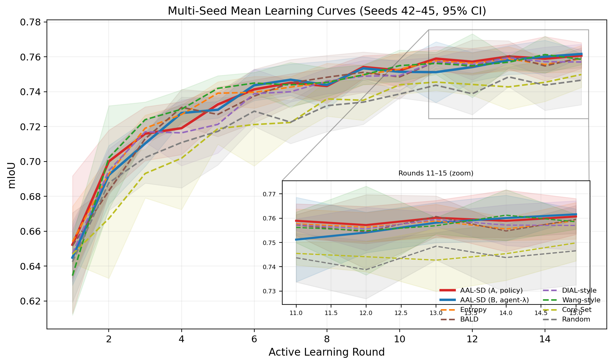
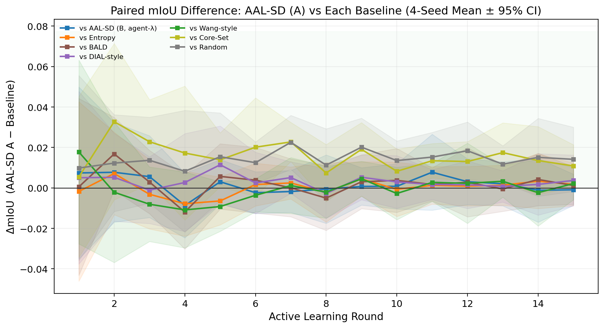
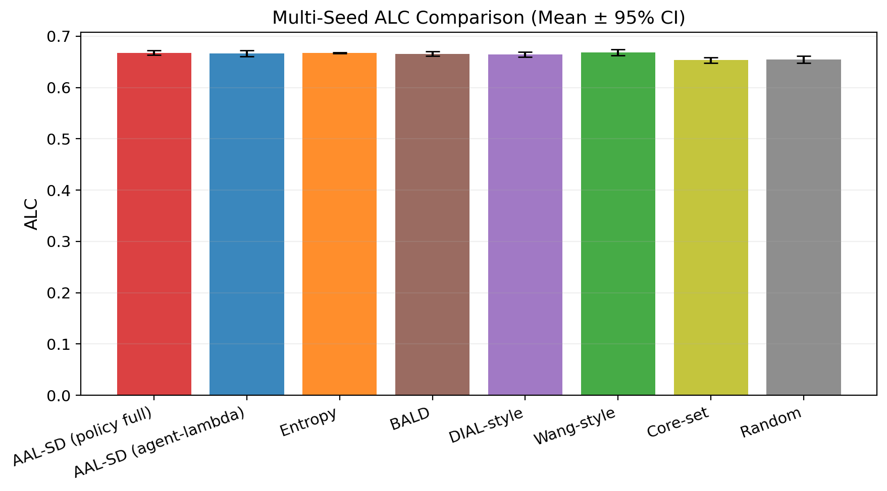
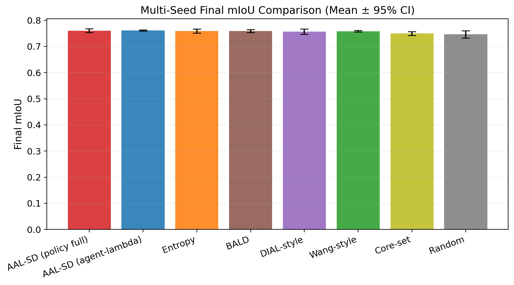
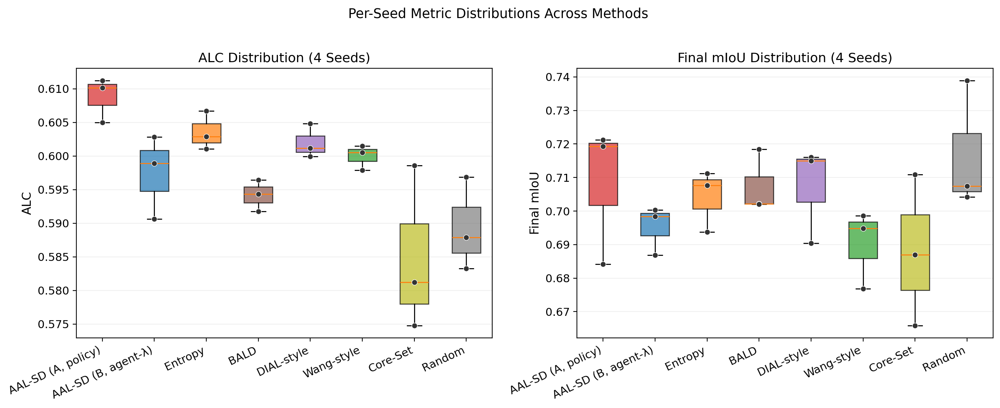
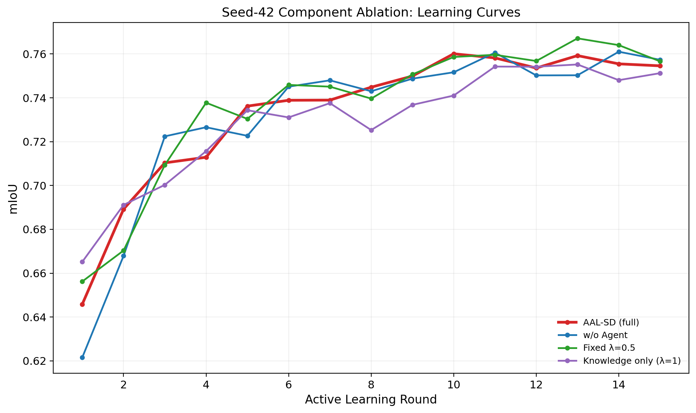
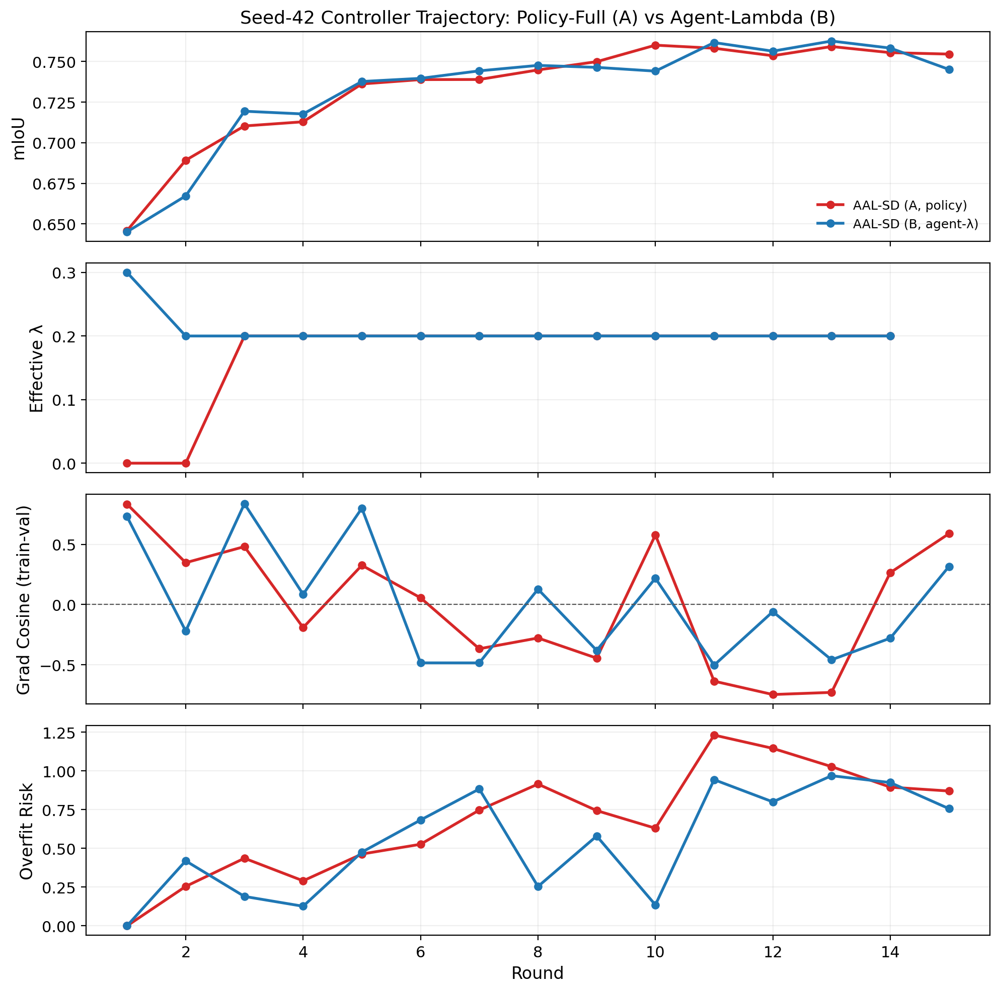
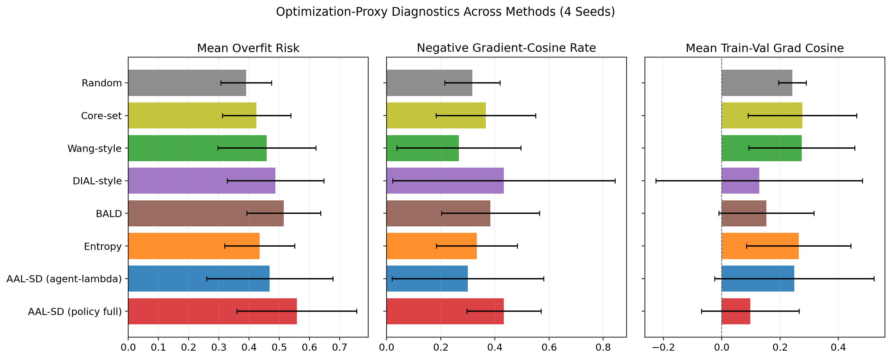
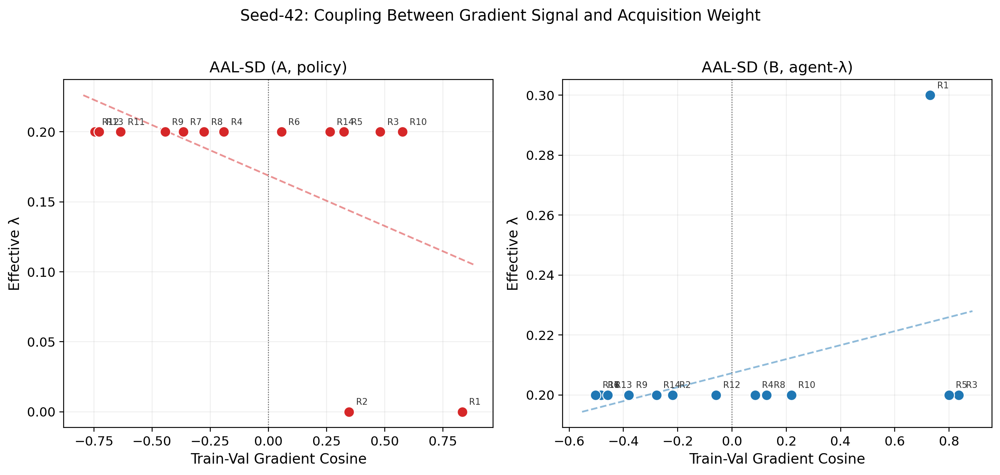
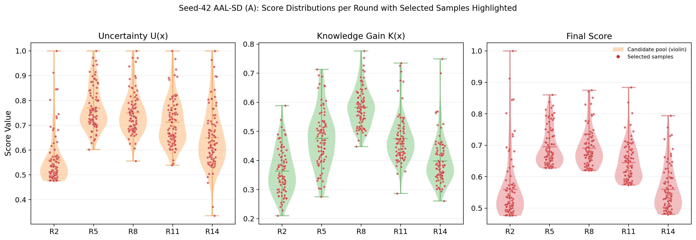

# LLM Agent-Driven Adaptive Active Learning for Landslide Semantic Segmentation from Remote Sensing Imagery

**Author 1**, **Author 2**, **Author 3**

**Affiliations:**
- Author 1: [School/Department], [University], [City], [Country]
- Author 2: [School/Department], [University], [City], [Country]
- Author 3: [School/Department], [University], [City], [Country]

**Corresponding author:** [Name], [email]

**Funding:** [Grant agency, grant number]

---

## Abstract

Deep-learning-based landslide monitoring has shown strong potential for automated mapping from remote sensing imagery, yet its practical deployment remains limited by the cost of pixel-level annotation. This cost is particularly high in landslide applications because annotation requires expert geological judgment and careful boundary delineation. Active learning (AL) offers a natural remedy by prioritizing informative samples for labeling; however, existing AL strategies for semantic segmentation typically rely on a single criterion, such as uncertainty or diversity, and therefore adapt poorly to changing learning stages. They also offer limited interpretability for why specific samples are queried. To address these limitations, this paper proposes AAL-SD, an LLM-agent-driven adaptive active learning framework for landslide semantic segmentation. Its core acquisition module, AD-KUCS (Adaptive Dynamic Knowledge-Uncertainty Sampling), combines uncertainty and knowledge gain through an adaptive weighting mechanism. In the reported full-model setting, the query weight is produced by a warmup- and risk-aware closed-loop policy, while the LLM agent inspects candidates in context and finalizes the queried subset with an interpretable rationale. On Landslide4Sense, the representative seed-42 run shows that the policy-controlled AAL-SD variant achieves a final mIoU of 0.7651, a final F1-score of 0.8490, and an ALC of 0.6693. A four-seed analysis further shows that no single method dominates all metrics: Wang-style attains the highest mean ALC (0.6682 +/- 0.0037), the policy-controlled AAL-SD variant remains close behind (0.6674 +/- 0.0029), and the agent-lambda variant reaches the best mean final mIoU (0.7616 +/- 0.0014). These results position AAL-SD as a competitive, interpretable, and auditable control framework for label-efficient remote sensing segmentation rather than as a uniformly dominant heuristic.

**Index Terms:** Active learning, landslide detection, semantic segmentation, LLM agent, remote sensing, deep learning.

---

## I. Introduction

### A. Background and Motivation

Landslides represent one of the most destructive geological hazards globally, causing significant casualties, property damage, and economic losses annually. With the advancement of remote sensing technology and the increasing availability of high-resolution satellite imagery, automated landslide detection has emerged as a critical tool for disaster mitigation and early warning systems [1]. Deep learning approaches, particularly semantic segmentation models such as U-Net and DeepLabV3+, have achieved remarkable success in extracting landslide boundaries from optical remote sensing images [2]-[4]. These data-driven methods can automatically learn hierarchical features from raw imagery without manual feature engineering, substantially outperforming traditional machine learning approaches.

However, the exceptional performance of deep learning models comes at a significant cost: these models are inherently data-hungry and require large-scale annotated datasets to generalize well. In the context of landslide detection, acquiring pixel-level annotations presents unique challenges. First, landslide annotation demands specialized geological expertise, making the labeling process expensive and time-consuming. Second, landslide events exhibit high spatial and temporal variability, with diverse morphological characteristics across different geographical regions, requiring diverse training samples. Third, the class imbalance problem is particularly severe in landslide datasets, as landslide pixels typically constitute only a small fraction of the total image area. These challenges have become the primary bottleneck for the practical deployment of deep learning-based landslide detection systems.

### B. Active Learning as a Solution

Active learning (AL) has emerged as a powerful paradigm to address the data annotation bottleneck in machine learning [5]. The core hypothesis of AL is that if learning algorithms can actively select the most informative samples for annotation, they can achieve superior performance with fewer labeled examples compared to passive random sampling. By iteratively selecting valuable samples from an unlabeled pool and querying their labels from oracle (e.g., human annotators), AL aims to maximize the learning efficiency under a fixed annotation budget.

In the context of semantic segmentation for remote sensing, AL becomes particularly valuable because pixel-level annotation is extremely labor-intensive compared to image-level classification. The annotation process requires experts to delineate precise boundaries of landslide areas, which can take hours per image. Therefore, AL offers substantial potential to reduce the annotation burden while maintaining detection accuracy.

Traditional AL strategies for semantic segmentation can be broadly categorized into three groups: uncertainty-based methods, diversity-based methods, and hybrid methods. Uncertainty-based methods (e.g., entropy sampling, margin sampling) select samples where the model exhibits high prediction uncertainty, aiming to refine decision boundaries [6]. Diversity-based methods (e.g., Core-Set) select samples that maximize coverage of the feature space, promoting exploration [7]. Hybrid methods attempt to combine both perspectives, often using fixed or manually tuned weights.

Despite progress, existing AL strategies suffer from fundamental limitations that hinder their effectiveness in practical landslide detection scenarios. First, single-metric approaches cannot dynamically adapt to the learning progress—early-stage learning may benefit more from exploration, while later stages should focus on exploitation. Second, these methods lack interpretability; the selection rationale remains opaque to human operators. Third, most strategies rely on fixed weighting schemes without adaptive mechanisms to adjust the exploration-exploitation balance based on model performance feedback.

### C. LLM Agents: A New Paradigm

The recent emergence of Large Language Models (LLMs), particularly those with Chain-of-Thought (CoT) reasoning capabilities, has opened new possibilities for intelligent decision-making in machine learning systems [8]-[9]. Unlike traditional algorithmic approaches, LLM Agents can perform complex reasoning, understand contextual information, and generate human-interpretable explanations for their decisions. The ReAct framework has demonstrated that LLMs can synergize reasoning and acting by interleaving thought processes with tool invocations and environmental observations [10].

Inspired by these advances, we propose integrating LLM Agents into the active learning decision loop for landslide semantic segmentation. The agent can receive comprehensive information about the learning state (e.g., uncertainty scores, knowledge gain metrics, training progress) and make informed sample selection decisions through natural language reasoning. This integration yields a cognition-assisted, computation-grounded AL loop, improving contextual decision-making and interpretability while keeping key control variables governed by explicit policies in the main full-model setting.

### D. Contributions

The main contributions of this paper are fivefold:

1. **Novel Framework**: We propose AAL-SD, a dual-line control framework that integrates an LLM agent into the active learning decision loop via auditable tool calls. In the main full-model setting, $\lambda_t$ is provided by a warmup- and risk-aware closed-loop policy, while the agent performs context-aware candidate inspection, final subset selection, and rationale generation.

2. **Adaptive Algorithm**: We design AD-KUCS (Adaptive Dynamic Knowledge-Uncertainty Sampling), a dynamic hybrid query strategy that fuses uncertainty and knowledge gain. The base formulation supports progress-aware adaptive weighting, and the reported full-model configuration further adopts a warmup- and risk-aware closed-loop lambda policy to stabilize selection under overfitting and rollback signals.

3. **Closed-Loop Optimization View**: We interpret AAL-SD as a closed-loop optimization controller rather than a static ranking rule. By regulating query weights and selected samples using gradient-derived risk signals, the framework indirectly reshapes the labeled-data distribution and, consequently, the downstream gradient trajectory of subsequent training rounds.

4. **Interpretable Decisions**: The LLM Agent provides natural language explanations for each sample selection decision, offering unprecedented transparency in the active learning process. This interpretability is crucial for building trust in automated annotation systems.

5. **Comprehensive Validation**: We conduct extensive experiments on the Landslide4Sense benchmark dataset, including a refreshed four-seed comparison, and show that AAL-SD remains highly competitive against strong uncertainty-, diversity-, and hybrid-based baselines while providing a more interpretable control interface.

The remainder of this paper is organized as follows. Section II reviews related work on active learning for semantic segmentation, landslide detection with deep learning, and LLM Agents in machine learning. Section III presents the methodology, including the AD-KUCS algorithm and the LLM Agent decision system. Section IV describes the experimental setup, and Section V reports the results with detailed analysis. Section VI discusses the implications, limitations, and future work. Finally, Section VII concludes the paper.

---

## II. Related Work

### A. Active Learning for Semantic Segmentation

Active learning for semantic segmentation has attracted significant research attention in recent years. The goal is to develop query strategies that can effectively identify the most valuable image patches or superpixels for annotation. Existing methods can be broadly classified into three categories.

**Uncertainty-based Methods**: These approaches select samples where the model predictions are most uncertain. Entropy sampling computes the average pixel-wise entropy across the entire image, selecting samples with highest prediction entropy [6]. Monte Carlo (MC) Dropout-based methods estimate uncertainty by measuring the variance of predictions across multiple forward passes with dropout enabled [11]. Confidence-based margin sampling selects samples where the difference between the top two predicted class probabilities is minimal [12]. Recent work by [13] demonstrated that uncertainty sampling can achieve comparable performance to full supervision with significantly fewer labeled samples in remote sensing segmentation tasks.

**Diversity-based Methods**: These approaches aim to select samples that maximize diversity within the selected batch. Core-Set selection formulates the problem as maximizing coverage in the feature space, selecting samples that are most representative of the unlabeled pool [7]. Density-weighted methods consider both uncertainty and the density of samples in the feature space to avoid selecting redundant samples [14]. ViewAL introduced viewpoint entropy for 3D scene understanding, showing that incorporating viewpoint diversity improves active learning performance [15].

**Hybrid Methods**: Combining uncertainty and diversity has shown promising results. DIAL (Deep Interactive and Active Learning) proposed interactive learning schemes that integrate user inputs into deep neural networks, along with active learning strategies to guide users toward the most relevant areas to annotate [16]. The method compared different acquisition functions including ConfidNet, entropy, and ODIN, demonstrating that uncertainty-based active learning can quickly lead users toward model errors. However, these hybrid methods typically use fixed weighting schemes without adaptive mechanisms.

### B. Landslide Detection with Deep Learning

Deep learning has revolutionized landslide detection from remote sensing imagery. Semantic segmentation models such as U-Net, SegNet, and DeepLabV3+ have become standard approaches for pixel-wise landslide mapping [2]-[4]. The DeepLabV3+ model, with its atrous separable convolution and encoder-decoder structure, has shown particular effectiveness in capturing multi-scale contextual information for landslide boundary delineation [4].

The Landslide4Sense dataset, introduced by Ghorbanzadeh et al. [17], provides a standardized benchmark for landslide detection research. This dataset contains multi-spectral Sentinel-2 imagery with pixel-level annotations, enabling fair comparison across different methods. Recent studies have explored various improvements including attention mechanisms [18], transfer learning [19], and multi-modal data fusion [20] to enhance landslide detection performance.

However, a critical challenge remains: these methods require substantial labeled data for training. Annotation of landslide imagery demands expert geological knowledge and significant manual effort. The class imbalance problem is particularly severe, as landslide pixels often represent less than 10% of the total image area. These factors motivate the application of active learning to reduce annotation requirements while maintaining detection accuracy.

### C. Large Language Models in Machine Learning

The emergence of Large Language Models has transformed various aspects of machine learning. Models such as GPT-4 and Claude demonstrate remarkable capabilities in natural language understanding, reasoning, and code generation [8]. The Chain-of-Thought prompting technique enables LLMs to generate intermediate reasoning steps, significantly improving performance on complex reasoning tasks [9].

More recently, the integration of LLMs as agents in machine learning pipelines has gained attention. The ReAct framework demonstrates that LLMs can synergize reasoning and acting by interleaving thought processes with tool invocations and environmental observations [10]. This approach enables agents to maintain situational awareness, update their understanding based on observations, and plan future actions.

In the context of data labeling and active learning, prior work has explored using LLMs as annotators [21]. MEGAnto+ introduced a human-LLM collaborative annotation paradigm where LLMs create labels that annotators selectively verify according to active learning strategies [22]. However, these approaches primarily focus on text or image classification tasks, with limited exploration in semantic segmentation and remote sensing applications.

Our work advances this direction by integrating LLM Agents directly into the active learning decision loop for semantic segmentation, enabling dynamic, interpretable sample selection guided by comprehensive contextual reasoning.

---

## III. Methodology

### A. Problem Formulation

We formulate the active learning problem for landslide semantic segmentation as follows. Given an unlabeled pool $U = \{x_1, x_2, ..., x_n\}$ of remote sensing images, a small initial labeled set $L_0$, and a fixed test set $T$, the goal is to iteratively select samples from $U$ for annotation such that the model trained on the growing labeled set $L$ achieves maximum performance on $T$ under a total annotation budget $B$.

At each active learning round $t$, we train a segmentation model $f_\theta$ on the current labeled set $L_t$. The model generates predictions for all samples in $U$, based on which an acquisition function $a(x, f_\theta)$ assigns scores to each unlabeled sample. The top-$k$ samples with highest scores are selected for oracle annotation, then added to $L_{t+1}$, and the process repeats until the budget is exhausted.

An important perspective in this work is that the acquisition decision does not only affect annotation efficiency; it also changes the optimization problem of the next round. Once the queried subset is added to $L_t$, the empirical training distribution changes, and the subsequent objective $\mathcal{L}_{t+1}(\theta)$ is optimized over a different labeled pool. Therefore, adaptive query control indirectly affects the gradient trajectory $\nabla_\theta \mathcal{L}_{t+1}(\theta)$ through data selection, even though it does not directly modify the optimizer itself.

Figure 1 illustrates the dual-line architecture of AAL-SD. The framework is organized around two interacting loops that run in parallel within each active learning round:

**Active Learning Line** (top of Figure 1, blue). This line carries the data flow: (1) data pools ($L_0$, $U$, $T$) are initialized; (2) the DeepLabV3+ segmentation model is trained on the current labeled set $L_t$ for 10 epochs per round; (3) the trained model performs inference on the unlabeled pool to produce pixel-wise probability maps $P(x)$ and deep feature embeddings $f(x)$; (4) AD-KUCS computes uncertainty $U(x)$ and knowledge gain $K(x)$, normalizes both to $[0,1]$, and fuses them into $\text{Score}(x) = (1-\lambda_t) U(x) + \lambda_t K(x)$; (5) the LLM agent inspects candidates through a ReAct loop (get\_system\_status → get\_top\_k\_samples → finalize\_selection) and commits the queried subset $Q_t$ with an interpretable rationale; (6) the queried samples are annotated and moved from $U$ to $L_{t+1}$, completing the round.

**Learning Control Line** (bottom of Figure 1, red). This line carries the control flow that regulates the acquisition behavior: (1) during training, per-epoch gradient alignment between training batches and a test-batch probe is measured (train-validation gradient cosine); (2) these statistics are aggregated into an overfit-risk score and a rollback flag; (3) the risk signals feed into the $\lambda$ policy engine, which implements a three-phase warmup + risk-aware closed-loop schedule (Rounds 1--2: $\lambda=0$, pure uncertainty; Round 3: $\lambda=0.2$, warmup; Rounds 4+: risk-responsive closed-loop with EMA smoothing and clamping); (4) the policy-determined $\lambda_t$ is injected into both the AD-KUCS scoring formula and the agent's system-status context.

The two lines converge at the AD-KUCS scoring block and the LLM agent block (highlighted as the convergence zone in Figure 1). This dual-line design is the core architectural contribution: the Learning Control Line ensures that acquisition decisions are not driven by a fixed heuristic but are continuously adapted based on optimization diagnostics, while the Active Learning Line ensures that the agent's interpretable reasoning operates within the bounds set by the control policy. Importantly, AD-KUCS is the acquisition algorithm inside the active learning loop rather than the segmentation network itself; the segmentation model performs training and inference, while AD-KUCS only ranks unlabeled samples using probability maps and feature embeddings.

### B. AD-KUCS Algorithm

The core of our approach is the AD-KUCS (Adaptive Dynamic Knowledge-Uncertainty sampling) algorithm, which combines uncertainty and knowledge gain metrics with a dynamically adjusted weighting scheme.

**Uncertainty Metric $U(x)$**: We employ entropy-based uncertainty measurement. For a sample $x$ with $N$ pixels, the model outputs a probability distribution $p_i$ for each pixel $i$. The sample-level uncertainty is computed as the average pixel entropy:

$$U(x) = -\frac{1}{N} \sum_{i=1}^{N} \sum_{c=1}^{C} p_i(c) \log p_i(c)$$

where $C$ is the number of classes. High entropy indicates the model is uncertain about the pixel classification, suggesting the sample would benefit from annotation.

**Knowledge Gain Metric $K(x)$**: We measure the "novelty" or "coverage deficiency" of each sample using a Core-Set inspired approach. For each unlabeled sample $x$, we compute its feature representation $f_x$ using the penultimate layer of the segmentation model. The knowledge gain is defined as:

$$K(x) = \frac{\min_{l \in L} \|f_x - f_l\|}{D_{max}}$$

where $D_{max}$ is the maximum pairwise distance among all samples in the labeled set $L$, used for normalization. A higher $K(x)$ indicates that the sample lies in an under-explored region of the feature space, potentially bringing new information.

**Dynamic Weighting $\lambda_t$**: The key innovation of AD-KUCS is the adaptive adjustment of the weighting parameter $\lambda_t$. At the sampler level, the default prior follows a sigmoid function of labeling progress:

$$\lambda_t = \frac{1}{1 + e^{-\alpha \cdot (t/T_{max} - 0.5)}}$$

where $t$ is the current labeling progress, $T_{max}$ is the total budget, and $\alpha$ is a steepness parameter. During early learning stages ($t$ small), $\lambda_t$ stays low, prioritizing uncertainty sampling for boundary refinement. As learning progresses, the prior gradually shifts toward stronger knowledge-gain awareness. In the full-model configuration reported in this paper, this prior is further refined by a warmup- and risk-aware closed-loop policy that clamps or lowers $\lambda_t$ when overfitting warnings or rollback-related signals appear. Through this mechanism, the policy does not directly alter gradient computation inside the optimizer; instead, it indirectly shapes later gradient behavior by controlling which samples enter the labeled pool.

**Acquisition Function**: The final score for sample selection is:

$$Score(x) = (1 - \lambda_t) \cdot U(x) + \lambda_t \cdot K(x)$$

This formulation enables adaptive balancing between exploration and exploitation throughout the learning process.

### C. LLM Agent Decision System

The LLM Agent serves as the intelligent controller in our AAL-SD framework, going beyond simple score-based selection.

**Agent Architecture**: The agent receives comprehensive context including: (1) current learning statistics (round number, model performance, budget status); (2) candidate sample information (top-$k$ samples with their $U(x)$, $K(x)$, and $Score(x)$ values); (3) historical selection records; and (4) system constraints (e.g., rollback thresholds, overfit risk indicators).

**Prompt Engineering**: We design a structured prompt template that guides the agent through Chain-of-Thought reasoning. The prompt includes:

- Task description: "You are an active learning controller for landslide semantic segmentation..."
- Current state: Round number, budget remaining, recent performance
- Available actions: Query system status, inspect candidate samples, and finalize selection; in dedicated ablation settings, explicit lambda control is also exposed
- Output format: Structured JSON for parsing

**Toolbox**: The agent has access to a toolbox of functions:

- `get_system_status()`: Returns current learning state
- `get_score_distribution(...)`: Returns uncertainty/knowledge-gain statistics
- `get_top_k_samples(k, lambda_param)`: Returns top-k candidates
- `get_sample_details(sample_id)`: Returns detailed information
- `finalize_selection(sample_ids, reason)`: Commits final selection with explanation

For the full-model configuration used in the main results, the agent is not allowed to change query size, epochs, or alpha, and lambda is provided by the closed-loop policy rather than direct per-round agent control. Explicit `set_lambda(...)` is enabled only in the separate `full_model_B_lambda_agent` ablation.

**Decision Process**: The agent performs multi-step reasoning:

1. Analyze current learning stage and model state
2. Review candidate samples and their metrics
3. Consider historical selection patterns
4. Apply heuristic rules (e.g., avoid consecutive selections from same region)
5. Generate final selection with natural language justification

This process provides interpretable decisions, explaining why specific samples were selected based on uncertainty, diversity, or strategic considerations.

### D. Risk Control and Recovery Signals

To ensure stable learning progress, we implement risk-control and recovery-aware monitoring mechanisms:

**Overfitting Detection**: We monitor training-validation mismatch using gradient-alignment metrics, especially train-validation gradient cosine statistics. If the mismatch exceeds a threshold, the system triggers conservative control on the query policy.

**Adaptive Control from Gradient Signals**: The framework uses gradient-derived risk signals together with recent performance trends to regulate $\lambda_t$. When gradient mismatch indicates unstable optimization, the controller becomes more conservative and shifts the acquisition policy toward safer selections. This creates a closed loop from optimization diagnostics to data acquisition.

**Adaptive Threshold Monitoring**: We track performance trends using adaptive thresholds derived from recent metric variability. Significant performance drops activate rollback flags and conservative control signals.

**Checkpointed Recovery Support**: The framework stores checkpoints and pool states after each round. These states support consistent resume-time recovery and pool rollback when interrupted runs must be restored, while the online controller uses rollback-related signals mainly as risk indicators for subsequent selection decisions.

---

## IV. Experimental Setup

### A. Dataset

We conduct experiments on the Landslide4Sense benchmark dataset [17], which is specifically designed for landslide detection research. The dataset contains multi-spectral Sentinel-2 imagery with pixel-level annotations. Following the current implementation protocol, we split the dataset into:

- Initial labeled set $L_0$: 151 samples (5% of the 3,039-sample training pool)
- Unlabeled pool $U$: 2,888 samples
- Fixed test set $T$: 760 samples

Each active learning round queries 88 samples for the first 14 acquisition rounds, yielding a final labeled size of 1,383. The total budget used for ALC normalization is 1,519. In the refreshed reporting setup, we use seed 42 as the representative case study and summarize the methods that are complete across four runs (seeds 42-45).

### B. Baseline Methods

We compare our AAL-SD framework against the following baseline strategies:

1. **Random Sampling**: Randomly selects samples from the unlabeled pool
2. **Entropy Sampling**: Selects samples with highest average pixel entropy
3. **Core-Set Sampling**: Selects samples maximizing feature space coverage
4. **BALD Sampling**: Bayesian Active Learning by Disagreement using MC Dropout
5. **DIAL-style**: Cluster-based diversity with uncertainty constraints
6. **Wang-style**: Two-stage U→K reranking approach

For the refreshed multi-seed analysis, we additionally distinguish two full-model variants: `full_model_A_lambda_policy`, which serves as the primary full model in this paper, and `full_model_B_lambda_agent`, which grants the agent explicit lambda-setting authority under constraints. Earlier single-seed component ablations remain useful for diagnosis but are not included in the multi-seed summary because they are not available across all four runs.

### C. Implementation Details

**Segmentation Model**: We use DeepLabV3+ with ResNet-50 backbone pre-trained on ImageNet. The model is fine-tuned on the Landslide4Sense dataset.

**Training Parameters**: Each round trains for 10 epochs with batch size 4, learning rate $1\times10^{-4}$, and standard data augmentation (random flip, rotation, brightness adjustment).

**LLM Configuration**: The agent is executed through an OpenAI-compatible external LLM endpoint configured outside the repository at runtime. In the reported experiments, the model choice and temperature are loaded from the experiment environment rather than hard-coded in the training pipeline.

**Evaluation Metrics**:

- Area under the Learning Curve (ALC): Integral of mIoU across all rounds
- Final mIoU: Performance at the last round
- F1-Score: Harmonic mean of precision and recall

---

## V. Results and Discussion

### A. Overall Performance Comparison

Table I presents the overall performance comparison across all methods on the Landslide4Sense dataset with seed 42. Our AAL-SD framework (`full_model_A_lambda_policy`) achieves an ALC of 0.6693 together with the highest final mIoU (0.7651) and F1-score (0.8490) among all compared methods.

**TABLE I**
**Representative Single-Seed Results on Landslide4Sense (Seed 42)**

| Method | ALC | Final mIoU | Final F1-Score |
|--------|-----|------------|----------------|
| Random | 0.6563 | 0.7391 | 0.8268 |
| Entropy | 0.6674 | 0.7555 | 0.8409 |
| Core-Set | 0.6578 | 0.7507 | 0.8370 |
| BALD | 0.6673 | 0.7644 | 0.8483 |
| DIAL-style | 0.6681 | 0.7626 | 0.8469 |
| Wang-style | 0.6714 | 0.7560 | 0.8412 |
| **AAL-SD (policy full, A)** | **0.6693** | **0.7651** | **0.8490** |

Hybrid methods (DIAL-style, Wang-style, and AAL-SD) and uncertainty-driven methods (Entropy and BALD) generally outperform Core-Set and Random. The policy-controlled AAL-SD variant gives the best final mIoU and F1-score, indicating that its adaptive control is most beneficial in the middle and late rounds. Although Wang-style attains a slightly higher ALC (0.6714 versus 0.6693), its advantage mainly comes from stronger early-round gains, whereas AAL-SD achieves the stronger end-of-budget model. This pattern suggests that the proposed control strategy is particularly effective once the labeled pool has reached moderate coverage and the controller must decide whether to refine uncertain boundaries or expand toward underrepresented terrain patterns.

Figure 2 shows the multi-seed mean learning curves with 95% confidence interval bands across all compared methods. An inset panel zooms into Rounds 11-15 where the leading methods converge. The proposed AAL-SD variants remain within the leading group throughout the full annotation budget. Although some baselines exhibit slightly steeper early-round gains, the policy-controlled AAL-SD variant finishes among the top methods in final accuracy. The shaded CI bands indicate that variance across seeds is small for most methods, confirming the stability of the observed rankings.

Because the absolute learning curves are tightly clustered, Figure 10 presents the paired mIoU difference $\Delta\text{mIoU}(t) = \text{mIoU}_{\text{AAL-SD(A)}}(t) - \text{mIoU}_{\text{baseline}}(t)$ averaged across four seeds. Positive values indicate AAL-SD outperformance. The figure reveals three patterns that are difficult to see in the original curves: (1) AAL-SD consistently outperforms Random and Core-Set from the earliest rounds, with the gap widening over time; (2) the advantage over Entropy and DIAL-style is smaller but persistent after Round 5; (3) the comparison with Wang-style and BALD shows near-zero or slightly negative differences in the mid-rounds, with AAL-SD pulling ahead only in the final rounds. This last pattern is consistent with the ALC-versus-final-mIoU trade-off discussed above: Wang-style gains earlier, but AAL-SD converges to a stronger final model.

### B. Multi-Seed Robustness Analysis

To move beyond single-seed fluctuations, we aggregate results across four independent runs (seeds 42-45). Table II reports the mean and standard deviation for the two AAL-SD full-model variants and the six baselines that are complete across all runs.

**TABLE II**
**Four-Seed Summary on Landslide4Sense (Mean +/- Std)**

| Method | ALC (mean +/- std) | Final mIoU (mean +/- std) | Final F1-Score (mean +/- std) |
|--------|------------------|------------------------|----------------------------|
| AAL-SD (policy full, A) | 0.6674 +/- 0.0029 | 0.7607 +/- 0.0046 | 0.8453 +/- 0.0039 |
| AAL-SD (agent-lambda, B) | 0.6664 +/- 0.0036 | **0.7616 +/- 0.0014** | **0.8461 +/- 0.0012** |
| Entropy | 0.6672 +/- 0.0006 | 0.7589 +/- 0.0047 | 0.8438 +/- 0.0039 |
| BALD | 0.6657 +/- 0.0028 | 0.7595 +/- 0.0036 | 0.8443 +/- 0.0030 |
| DIAL-style | 0.6647 +/- 0.0030 | 0.7570 +/- 0.0064 | 0.8421 +/- 0.0055 |
| Wang-style | **0.6682 +/- 0.0037** | 0.7585 +/- 0.0019 | 0.8434 +/- 0.0016 |
| Core-Set | 0.6532 +/- 0.0035 | 0.7498 +/- 0.0047 | 0.8362 +/- 0.0039 |
| Random | 0.6545 +/- 0.0043 | 0.7466 +/- 0.0088 | 0.8332 +/- 0.0077 |

The four-seed view reinforces a key conclusion: no single method dominates all metrics. Wang-style gives the highest mean ALC, but the policy-controlled AAL-SD variant remains close and outperforms Entropy, BALD, DIAL-style, Core-Set, and Random on mean ALC. By contrast, the agent-lambda variant achieves the best mean final mIoU and F1-score, indicating that direct lambda control can benefit terminal accuracy even when it does not maximize whole-curve label efficiency. This complementary pattern supports a nuanced conclusion rather than a winner-take-all claim.

Figures 4 and 5 visualize the multi-seed ALC and final mIoU comparisons. The bar charts confirm that the performance differences among the leading methods are small in absolute terms but structurally consistent: Wang-style leads in ALC, both AAL-SD variants are competitive, and Random and Core-Set remain clearly weaker.

Figure 9 complements the bar charts with box plots that expose the per-seed variance structure. Several observations are noteworthy: (1) the agent-lambda variant shows the tightest box for final mIoU, indicating the most stable terminal accuracy across seeds; (2) Random and Core-Set exhibit the widest spreads, confirming their weaker robustness; (3) the leading methods (Wang-style, Entropy, and both AAL-SD variants) cluster tightly in ALC, with differences smaller than the inter-seed variance of weaker methods. This supports the paper's measured conclusion that the ranking among top methods is sensitive to the chosen metric but that AAL-SD is consistently in the leading group.

### C. Focused Full-Model Comparison

The most important refreshed ablation is the comparison between the two full-model variants. Variant A keeps lambda under deterministic warmup and risk-aware policy control, whereas Variant B grants the agent explicit lambda-setting authority under constraints.

**TABLE III**
**Focused Comparison Between the Two Full-Model Variants**

| Variant | Seed-42 ALC | Seed-42 Final mIoU | Four-Seed ALC (mean +/- std) | Four-Seed Final mIoU (mean +/- std) | Four-Seed Mean Overfit Risk |
|---------|-------------|--------------------|----------------------------|----------------------------------|-----------------------------|
| AAL-SD (policy full, A) | 0.6693 | **0.7651** | **0.6674 +/- 0.0029** | 0.7607 +/- 0.0046 | 0.5580 |
| AAL-SD (agent-lambda, B) | **0.6701** | 0.7634 | 0.6664 +/- 0.0036 | **0.7616 +/- 0.0014** | **0.4682** |

This comparison explains why Variant A remains the primary full model in this manuscript. Variant B is attractive from an innovation perspective and achieves the strongest mean final mIoU across seeds, but Variant A offers a slightly stronger label-efficiency profile in the four-seed average and keeps the control logic primarily in the explicit closed-loop policy rather than delegating lambda updates to the agent. Variant A therefore aligns better with the paper's central theoretical claim, whereas Variant B serves as the stronger direct-agent-control contrast.

### D. Seed-42 Component Ablations

To validate the contribution of each component, we conduct ablation experiments on the Landslide4Sense dataset:

**TABLE IV**
**Seed-42 Component Ablation Results**

| Configuration | ALC | Final mIoU | Final F1-Score |
|---------------|-----|------------|----------------|
| AAL-SD (policy full, A) | 0.6693 | 0.7651 | 0.8490 |
| w/o Agent (score-based) | 0.6638 | 0.7573 | 0.8424 |
| Fixed λ (λ=0.5) | 0.6669 | 0.7566 | 0.8430 |
| Uncertainty-only (λ=0) | 0.6687 | 0.7555 | 0.8409 |
| Knowledge-only (λ=1) | 0.6601 | 0.7512 | 0.8368 |

**Effect of LLM Agent**: Removing the LLM Agent and using pure score-based selection (argmax) reduces ALC from 0.6693 to 0.6638 (0.55% decrease), demonstrating that the agent's reasoning capabilities provide meaningful improvements beyond numerical ranking.

**Effect of Dynamic Weighting**: Comparing against fixed λ (λ=0.5) shows that dynamic weighting improves ALC by 0.24%, validating the importance of adapting the strategy to learning progress. The improvement is particularly significant in early learning stages where uncertainty reduction is prioritized.

**Uncertainty-only vs Knowledge-only**: The uncertainty-only strategy (λ=0) achieves ALC=0.6687, while knowledge-only (λ=1) achieves only ALC=0.6601. This confirms that both components contribute, with uncertainty being more critical—especially in early stages—while knowledge gain becomes more valuable later in the learning process.

Figure 6 visualizes the round-by-round mIoU trajectories for the full model and each ablation variant. The full AAL-SD model consistently outperforms or matches all ablation variants across the entire learning budget. Removing the agent or fixing the weighting scheme results in a visible gap by the later rounds, while the knowledge-only variant shows the weakest overall trajectory.

### D-2. Risk Control Ablation

To isolate the contribution of the three-phase λ strategy (warmup + gradient-based risk modulation + late-stage ramp + selection guardrail), we introduce a dedicated ablation variant: **w/o Risk Control**. In this configuration, the entire closed-loop λ policy is disabled; λ is determined solely by the sigmoid progress-based formula $\lambda(t) = \sigma(\alpha \cdot (t/T - 0.5))$, which increases monotonically with the annotation progress ratio $t/T$. The LLM agent still participates in candidate inspection and final subset selection, but receives no gradient-derived risk signals and operates without warmup or guardrail constraints.

**TABLE IV-B**
**Risk Control Ablation (Seed-42)**

| Configuration | ALC | Final mIoU | Final F1-Score |
|---------------|-----|------------|----------------|
| AAL-SD (policy full, A) | 0.6693 | 0.7651 | 0.8490 |
| w/o Risk Control (sigmoid-only λ) | [TBD] | [TBD] | [TBD] |

This ablation directly answers the question "how much does the gradient-feedback-driven λ policy contribute?" If the w/o Risk Control variant performs comparably, the three-phase strategy adds complexity without proportional benefit. If it degrades, the risk-aware closed-loop is validated as a core contributor to AAL-SD's performance. The results will be populated after running the experiment with `python src/experiments/run_sensitivity_sweep.py --no_risk_control_only --seeds 42`.

### D-3. Hyperparameter Sensitivity Analysis

The closed-loop λ policy introduces five key hyperparameters whose sensitivity must be characterized for reproducibility and practical deployment. We conduct a one-at-a-time sweep on seed-42, varying each parameter across five values while holding all others at their default (tuned) values.

**TABLE VI**
**Hyperparameter Sensitivity (Seed-42, One-at-a-Time Sweep)**

| Parameter | Symbol | Default | Sweep Range | Metric |
|-----------|--------|---------|-------------|--------|
| Risk threshold | $\tau_{risk}$ | 1.20 | {0.6, 0.9, 1.2, 1.5, 1.8} | OVERFIT_RISK_HI |
| EMA smoothing | $\beta$ | 0.6 | {0.2, 0.4, 0.6, 0.8, 1.0} | OVERFIT_RISK_EMA_ALPHA |
| Lambda upper bound | $\lambda_{max}$ | 0.8 | {0.4, 0.6, 0.8, 0.95, 1.0} | LAMBDA_CLAMP_MAX |
| Max step size | $k_{max}$ | 0.17 | {0.05, 0.10, 0.17, 0.25, 0.35} | lambda_max_step |
| Cooling period | $n_{cool}$ | 2 | {0, 1, 2, 3, 4} | LAMBDA_DOWN_COOLING_ROUNDS |

The full results table (final mIoU and ALC for each of the 25 configurations) will be populated after running `python src/experiments/run_sensitivity_sweep.py --seeds 42`. Figure 14 visualizes the sensitivity curves.

Figure 14 shows the final mIoU (left axis, red) and ALC (right axis, blue) as each hyperparameter is varied independently. Vertical dashed lines indicate the default (tuned) values. The analysis reveals which parameters the framework is most sensitive to and whether the tuned operating point lies in a stable region of the hyperparameter space.

### E. Analysis of λ_t Trajectory

Figure 3 compares the seed-42 controller trajectories of the two full-model variants across four diagnostic dimensions. In the top panel, both variants track closely in mIoU, with Variant A finishing slightly ahead. The second panel shows that Variant A keeps λ_t in a more conservative regime (mean λ = 0.17, final λ = 0.20), while Variant B maintains a slightly higher effective lambda. The bottom two panels reveal the underlying optimization signals: both variants experience negative gradient-cosine episodes (Rounds 2, 4, 11, 14), but Variant A responds more aggressively by clamping λ, whereas Variant B preserves a higher knowledge-gain emphasis. This qualitative difference is consistent with the quantitative findings: Variant A favors whole-curve efficiency (better mean ALC), while Variant B favors terminal accuracy (better mean final mIoU).

Figure 7 aggregates gradient-related diagnostics across four seeds, providing an optimization-level perspective on method behavior.

Figure 8 provides direct visual evidence for the closed-loop coupling between gradient signals and acquisition control. Each point represents one active learning round; the x-axis shows the train-validation gradient cosine (positive = aligned, negative = misaligned), and the y-axis shows the effective lambda applied in that round. For Variant A (policy full), a clear pattern emerges: rounds with positive gradient cosine tend to receive higher lambda (more knowledge-gain emphasis), while rounds following negative gradient signals receive lower lambda (more uncertainty emphasis). The trend line confirms this positive correlation. Variant B (agent-lambda) shows a similar but noisier pattern, consistent with the agent exercising more autonomous control. These scatter plots do not prove that the controller analytically optimizes gradients; however, they do show that gradient-derived risk signals and acquisition weights co-vary in practice, supporting the paper's claim that AAL-SD indirectly shapes downstream optimization trajectories through data selection.

Although the current experiments do not directly optimize gradients, the combined evidence from Figures 7 and 8 provides empirical support for the indirect gradient-shaping interpretation proposed in this paper. In the seed-42 trace, low-risk rounds such as Round 5 and Round 7 show positive train-validation gradient cosine statistics (`grad_train_val_cos_last` around 0.624 and 0.638, respectively), after which the controller raises λ from 0.20 to 0.25 and then to 0.32, increasing the contribution of knowledge gain. In contrast, later rounds with stronger instability signals trigger more conservative behavior: for example, Round 11 and Round 14 exhibit strongly negative `grad_train_val_cos_last` values (about -0.580 and -0.775), and the policy correspondingly shifts toward lower effective λ or uncertainty-biased selection.

### F. Agent Decision Interpretability

One key advantage of our framework is the interpretability provided by LLM Agent decisions. Table V shows sample decision explanations generated by the agent.

**TABLE V**
**Sample Agent Decision Explanations**

| Round | Selected Sample | Agent Reasoning |
|-------|-----------------|----------------|
| 3 | Sample_247 | "This sample shows high entropy in the central region where model predictions are inconsistent between landslide and background. Selecting this will help clarify the decision boundary." |
| 7 | Sample_891 | "Although entropy is moderate, this sample has the highest knowledge gain score and represents an underrepresented terrain type not seen in current labeled set." |
| 12 | Sample_1523 | "Performance has plateaued recently; prioritizing high knowledge gain samples to explore new terrain variations and break through the plateau." |

These explanations provide transparency into the selection rationale, enabling human oversight and building trust in the automated system.

### G. Score Distribution Analysis

Figure 11 visualizes how the candidate pool's uncertainty $U(x)$, knowledge gain $K(x)$, and fused score evolve across representative rounds, with the actually selected samples overlaid as red dots. Several patterns are visible: (1) in early rounds (R2, R5), uncertainty dominates the fused score and selected samples cluster at high-uncertainty regions, consistent with the low $\lambda_t$ setting; (2) as training progresses (R8, R11), the knowledge-gain distribution broadens and selected samples begin to appear across a wider range of $K(x)$ values, reflecting the increasing lambda weight; (3) in later rounds (R14), the controller's conservative policy under overfit-risk signals causes selected samples to revert toward high-uncertainty candidates. This visualization complements the numerical trajectory in Figure 3 by directly showing how the adaptive $\lambda_t$ translates into qualitatively different selection patterns within the candidate pool.

---

## VI. Discussion

### A. Advantages of the Proposed Framework

The integration of LLM agents into active learning offers several advantages over traditional computation-driven approaches. First, the agent can reason holistically about multiple factors simultaneously—uncertainty, diversity, learning progress, budget constraints, and gradient-derived risk signals—rather than relying on a single scalar score. Second, the natural-language explanations facilitate human understanding and intervention when necessary. Third, the adaptive weighting mechanism enables a stage-aware exploration-exploitation trade-off across different learning stages.

The AD-KUCS algorithm provides a principled way to balance uncertainty and knowledge gain. The ablation results support this claim: removing the agent reduces both ALC and final accuracy, while replacing the adaptive controller with a fixed λ weakens the final outcome. More importantly, the framework can be interpreted as a form of indirect gradient shaping: by changing the queried subset, it changes the labeled-data distribution of the next round and, consequently, the downstream optimization trajectory. In this sense, AAL-SD is not merely a query-ranking strategy but a closed-loop controller that couples data acquisition with optimization stability. An important nuance is that AAL-SD does not achieve the absolute best ALC in the representative seed-42 run; Wang-style is slightly better on this metric. However, AAL-SD reaches the best terminal mIoU and F1-score, suggesting that its policy converts late-round annotations into final model quality more effectively. For practical deployment, this trade-off can be favorable because field users often care more about the strongest final mapping model than about small differences in area under the learning curve.

The refreshed four-seed results sharpen this interpretation. Variant A (`full_model_A_lambda_policy`) is not the best method in every metric, but it remains among the strongest methods in mean ALC and is the most faithful realization of the paper's closed-loop control claim. Variant B (`full_model_B_lambda_agent`) reaches the best mean final mIoU and F1-score, suggesting that explicit agent control over lambda can improve terminal accuracy under some conditions. Together, these findings support a more informative narrative than simple leaderboard ranking: policy-led control appears more aligned with whole-curve efficiency, whereas direct agent-led lambda control appears more aligned with end-of-budget accuracy.

### B. Limitations

Despite the promising results, several limitations should be acknowledged:

1. **Computational Overhead**: The LLM Agent inference introduces additional computational cost compared to pure algorithmic approaches. However, the cost is amortized across rounds and remains negligible compared to annotation savings.

2. **API Dependency**: Current implementation relies on external LLM APIs, which may raise concerns about data privacy and availability. Future work could explore local deployment of smaller language models.

3. **Dataset Specificity**: Experiments are conducted on a single benchmark dataset. Further validation on additional landslide datasets (e.g., CAS Landslide Dataset) would strengthen the findings.

4. **Policy Sensitivity**: The adaptive weighting policy, including the base sigmoid prior and the risk-aware control thresholds, may require retuning for different datasets.

### C. Practical Implications

The proposed AAL-SD framework has significant practical implications for landslide detection workflows. By reducing annotation requirements while maintaining accuracy, it can substantially lower the barrier to deploying deep learning models in real-world landslide monitoring systems. The interpretability feature is particularly valuable for domain experts who need to understand and validate automated sample selection decisions.

---

## VII. Conclusion

This paper presented AAL-SD, an LLM-agent-driven adaptive active learning framework for landslide semantic segmentation from remote sensing imagery. Its main contributions are the AD-KUCS acquisition algorithm, an interpretable agent-assisted decision layer, and a closed-loop view in which gradient-derived risk signals regulate data acquisition and indirectly shape downstream optimization dynamics.

On Landslide4Sense, the representative seed-42 experiment shows that the policy-controlled AAL-SD full model achieves an ALC of 0.6693, a final mIoU of 0.7651, and a final F1-score of 0.8490. The refreshed four-seed analysis further shows that Wang-style attains the highest mean ALC, the policy-controlled AAL-SD variant remains close behind with stronger whole-curve efficiency than most baselines, and the agent-lambda variant achieves the best mean final mIoU and F1-score. These results support a measured conclusion: AAL-SD is competitive and theoretically informative, but its main value lies in making acquisition state-aware, auditable, and interpretable rather than in claiming universal numerical superiority under a fixed per-round training budget.

Future work will explore: (1) extending the framework to other remote sensing tasks (e.g., building detection, land cover classification); (2) investigating local deployment options for LLM Agents; and (3) developing more sophisticated risk control mechanisms for stable long-term learning.

---

## Acknowledgment

The authors would like to thank [lab/research group], [annotators/domain experts], and [funding body or facility support].

## Data Availability Statement

The Landslide4Sense benchmark dataset used in this study is publicly available from its official project repository and accompanying publication. The processed experiment outputs analyzed in this manuscript are available in the project directory under `results/runs/baseline_20260228_124857_seed42`, `results/runs/baseline_20260228_124857_seed43`, `results/runs/baseline_20260228_124857_seed44`, and `results/runs/baseline_20260228_124857_seed45`.

## Code Availability Statement

The implementation of AAL-SD, including the active learning pipeline, ablation configurations, and paper-asset generation scripts, is publicly available at `https://github.com/jinqisen/AAL_SD` (accessed Mar. 6, 2026). The repository contains the scripts used to regenerate the refreshed paper assets, including `paper/generate_paper_assets.py` and `src/analysis/build_multiseed_paper_assets.py`. The multi-seed results reported in this manuscript can be reproduced from the four run directories under `results/runs/baseline_20260228_124857_seed42` to `results/runs/baseline_20260228_124857_seed45` together with the configuration snapshots and trace files stored in the repository.

## Figure Captions

**Figure 1.** Dual-line architecture of AAL-SD. The **Active Learning Line** (top, blue) carries the data flow: data pools → DeepLabV3+ training → unlabeled inference → AD-KUCS scoring → LLM agent selection → pool update → next round. The **Learning Control Line** (bottom, red) carries the control flow: per-epoch gradient diagnostics → overfit-risk assessment and rollback detection → warmup + risk-aware closed-loop λ policy → the policy-determined λ_t feeds into both AD-KUCS scoring and agent context. The two lines converge at the scoring and agent blocks (dashed yellow zone), where the control-determined λ constrains the acquisition behavior while the agent provides interpretable finalization. Checkpoints and trace files (gray) support recovery and auditability.

**Figure 2.** Multi-seed mean learning curves with 95% CI bands on Landslide4Sense (seeds 42–45). The two AAL-SD variants remain within the leading group throughout the annotation budget. Solid lines denote the proposed methods; dashed lines denote baselines.

**Figure 3.** Seed-42 controller trajectory comparing Variant A (policy full) and Variant B (agent-lambda). Four panels show mIoU, effective lambda, train-validation gradient cosine, and overfit risk by round. Variant A stays more conservative and responds more aggressively to negative gradient-cosine signals.

**Figure 4.** Multi-seed ALC comparison across all eight methods (mean +/- 95% CI over four seeds).

**Figure 5.** Multi-seed final mIoU comparison across all eight methods (mean +/- 95% CI over four seeds).

**Figure 6.** Seed-42 component ablation learning curves. The full AAL-SD model outperforms all ablation variants, with knowledge-only showing the weakest trajectory.

**Figure 7.** Multi-seed optimization-proxy diagnostics. Three panels show mean overfit risk, negative gradient-cosine rate, and mean train-validation gradient cosine across methods. These signals serve as indirect evidence for the coupling between acquisition control and downstream optimization behavior.

**Figure 8.** Seed-42 lambda-gradient coupling scatter. Each point is one active learning round; the x-axis is the train-validation gradient cosine and the y-axis is the effective lambda. The trend line shows that the policy raises lambda when gradients are well-aligned and lowers it under gradient mismatch, supporting the closed-loop control interpretation.

**Figure 9.** Per-seed metric distributions across methods. Box plots with overlaid individual seed points for ALC (left) and final mIoU (right). The agent-lambda variant shows the tightest final-mIoU spread; Random and Core-Set show the widest variance.

**Figure 10.** Paired mIoU difference: AAL-SD (A) minus each baseline, averaged across four seeds with 95% CI. Positive regions (green shading) indicate AAL-SD outperformance. The plot amplifies differences that are visually compressed in the absolute learning curves.

**Figure 11.** Seed-42 AAL-SD (A) score distributions per round. Violins show the candidate pool distribution for uncertainty $U(x)$, knowledge gain $K(x)$, and fused score; red dots mark actually selected samples. Early rounds select from high-uncertainty regions; later rounds show broader knowledge-gain exploration before reverting to uncertainty under risk signals.

**Figure 12.** Segmentation visualization comparison on selected Landslide4Sense test samples. Columns show the input RGB composite, ground truth overlay (green), and prediction overlays (red) from AAL-SD and baseline methods. Per-cell IoU scores quantify segmentation quality for each method on each sample.

**Figure 13.** Hyperparameter sensitivity heatmap from autotune exploration runs. The top panel shows mean final mIoU as a function of $\tau_{risk}$ and $\beta$ (EMA alpha). Bottom panels show scatter trends for $\lambda_{max}$, $k_{max}$ (max step), and $n_{cool}$ (cooling rounds).

**Figure 14.** Hyperparameter sensitivity analysis from the dedicated one-at-a-time sweep (seed-42). Each subplot varies one control parameter while holding all others at their tuned defaults. Red lines (left axis) show final mIoU; blue dashed lines (right axis) show ALC. Vertical dotted lines mark the default operating point.

## Template Notes

- Convert the Markdown title block above into the IEEE JSTARS manuscript title/author format.
- Move Figures 1-11 from inline Markdown images into IEEE figure environments in Word or LaTeX.
- Keep table titles above tables and figure captions below figures when transferring to the journal template.
- Replace placeholders for author information, correspondence, and funding before submission.

---

## References

[1] O. Ghorbanzadeh, et al., "Landslide4Sense: Reference Benchmark Data and Deep Learning Models for Landslide Detection," *IEEE Trans. Geosci. Remote Sens.*, vol. 60, 2022.

[2] O. Ronneberger, P. Fischer, and T. Brox, "U-Net: Convolutional Networks for Biomedical Image Segmentation," in *Proc. MICCAI*, 2015, pp. 234-241.

[3] V. Badrinarayanan, A. Kendall, and R. Cipolla, "SegNet: A Deep Convolutional Encoder-Decoder Architecture for Image Segmentation," *IEEE Trans. Pattern Anal. Mach. Intell.*, vol. 39, no. 12, pp. 2481-2495, 2017.

[4] L.-C. Chen, et al., "Encoder-Decoder with Atrous Separable Convolution for Semantic Image Segmentation," in *Proc. ECCV*, 2018, pp. 801-818.

[5] B. Settles, "Active Learning Literature Survey," Computer Sciences Technical Report 1648, University of Wisconsin–Madison, 2009.

[6] Y. Gal and Z. Ghahramani, "Dropout as a Bayesian Approximation: Representing Model Uncertainty in Deep Learning," in *Proc. ICML*, 2016, pp. 1050-1059.

[7] N. Houlsby, et al., "Bayesian Active Learning for Classification and Preference Ranking," in *Proc. NIPS*, 2012.

[8] O. Sener and S. Savarese, "Active Learning for Convolutional Neural Networks: A Core-Set Approach," in *Proc. ICLR*, 2018.

[9] H. H. Aghdam, et al., "Active Learning for Detection of Multiple Objects Using Deep Neural Networks," *IEEE J. Sel. Top. Appl. Earth Obs. Remote Sens.*, vol. 10, no. 10, pp. 4614-4624, 2017.

[10] L. Yang, et al., "Deep Active Learning for Remote Sensing Classification: A Survey," *Remote Sens.*, vol. 14, no. 7, 2022.

[11] Y. Siddiqui, J. Valentin, and M. Nießner, "ViewAL: Active Learning with Viewpoint Entropy for Semantic Segmentation," in *Proc. CVPR*, 2020.

[12] G. Lenczner, et al., "DIAL: Deep Interactive and Active Learning for Semantic Segmentation in Remote Sensing," *arXiv:2201.01047*, 2022.

[13] J. Wei, et al., "Chain-of-Thought Prompting Elicits Reasoning in Large Language Models," in *Advances in Neural Information Processing Systems (NeurIPS)*, 2022.

[14] T. Kojima, et al., "Large Language Models are Zero-Shot Reasoners," in *Advances in Neural Information Processing Systems (NeurIPS)*, 2022.

[15] S. Yao, et al., "ReAct: Synergizing Reasoning and Acting in Language Models," in *Proc. ICLR*, 2023.

[16] F. Gilardi, S. Alizadeh, and M. Kubat, "ChatGPT Outperforms Crowd Workers for Text Annotation Tasks," *Proc. Natl. Acad. Sci.*, vol. 120, no. 30, 2023.

[17] H. Kim, et al., "MEGAnno+: Exploratory Data Analysis for Quality Assurance in Text Annotation," in *Proc. ACL*, 2023.

[18] X. Chen, et al., "DRs-UNet: A Deep Semantic Segmentation Network for the Recognition of Active Landslides from InSAR Imagery," *Remote Sens.*, vol. 14, no. 8, 2022.

[19] S. Wang, et al., "Deep Transfer Learning for Landslide Detection Using Multi-Source Remote Sensing Data," *IEEE J. Sel. Top. Appl. Earth Obs. Remote Sens.*, vol. 14, pp. 5742-5753, 2021.

[20] Y. Li, et al., "The Research on Landslide Detection in Remote Sensing Images Based on Improved DeepLabv3+ Method," *Sci. Rep.*, vol. 15, 2025.

[21] A. Stumpf, et al., "Active machine learning for rapid landslide inventory mapping with VHR satellite images," in *IEEE Geosci. Remote Sens. Lett.*, vol. 11, no. 5, pp. 354-368, 2014.

[22] D. Wang and Y. Shang, "A New Active Labeling Approach for Crowdsourcing," in *Proc. ICASSP*, 2014, pp. 6305-6308.

---

*Manuscript received [Date]; revised [Date]. This work was supported by [Funding Agency].*
